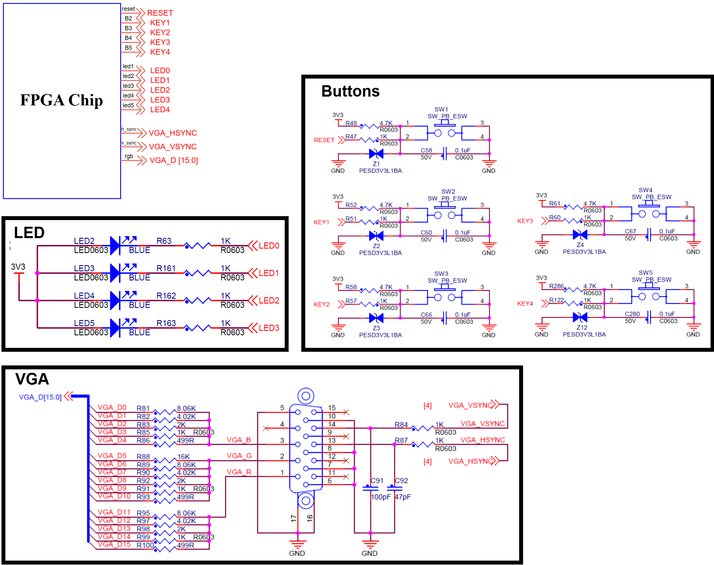

# VGA 模拟器安装与使用手册 / VGA Simulator Installation & Usage Manual

---

## 📑 目录 / Table of Contents

1. [简介 / Introduction](#1-简介--introduction)
2. [准备工作 / Prerequisites](#2-准备工作--prerequisites)
   - 2.1 [Linux 命令行基础 / Linux Command Line Basics](#21-linux-命令行基础--linux-command-line-basics)
   - 2.2 [Mac 命令行基础 / Mac Command Line Basics](#22-mac-命令行基础--mac-command-line-basics)
3. [系统安装 / System Installation](#3-系统安装--system-installation)
   - 3.0 [推荐方案：使用预配置镜像（强烈推荐）/ Recommended: Use Pre-configured Image](#30-推荐方案使用预配置镜像强烈推荐--recommended-use-pre-configured-image-strongly-recommended)
   - 3.1 [手动安装方案（备选）/ Manual Installation (Alternative)](#31-手动安装方案备选--manual-installation-alternative)
   - 3.2 [Windows 备选方案：WSL / Windows Alternative: WSL](#32-windows-subsystem-for-linux-wsl)
   - 3.3 [Mac 原生环境 / Mac Native Environment](#33-mac-原生环境--mac-native-environment)
4. [工具安装 / Tool Installation](#4-工具安装--tool-installation)
   - 4.1 [Ubuntu/Linux 安装步骤 / Ubuntu/Linux Installation](#41-ubuntulinux-安装步骤--ubuntulinux-installation)
   - 4.2 [Mac 安装步骤 / Mac Installation](#42-mac-安装步骤--mac-installation)
   - 4.3 [验证安装 / Verify Installation](#43-验证安装--verify-installation)
5. [下载模拟器 / Download Simulator](#5-下载模拟器--download-simulator)
6. [使用教程 / Usage Tutorial](#6-使用教程--usage-tutorial)
   - 6.1 [了解开发板模块 / Understanding the Development Board](#61-了解开发板模块--understanding-the-development-board)
   - 6.2 [准备你的 Verilog 代码 / Preparing Your Verilog Code](#62-准备你的-verilog-代码--preparing-your-verilog-code)
   - 6.3 [配置 DevelopmentBoard.v / Configuring DevelopmentBoard.v](#63-配置-developmentboardv--configuring-developmentboardv)
   - 6.4 [运行模拟器 / Running the Simulator](#64-运行模拟器--running-the-simulator)
7. [示例项目 / Example Projects](#7-示例项目--example-projects)
8. [故障排除 / Troubleshooting](#8-故障排除--troubleshooting)
9. [附录：Linux 路径详解 / Appendix: Linux Paths Explained](#9-附录linux-路径详解--appendix-linux-paths-explained)

---

## 1. 简介 / Introduction

本手册面向 FPGA 课程学生，详细介绍如何安装和使用 VGA 模拟器。无需购买昂贵的 FPGA 开发板，你就可以在电脑上模拟 VGA 显示效果。

This manual is designed for FPGA course students, providing detailed instructions on how to install and use the VGA simulator. You can simulate VGA display effects on your computer without purchasing expensive FPGA development boards.

### 模拟器功能 / Simulator Features

| 功能 / Feature | 说明 / Description |
|---------------|-------------------|
| 🖥️ VGA 显示 / VGA Display | 640×480 分辨率，60Hz 刷新率，RGB565 16位彩色 / 640×480 resolution, 60Hz refresh rate, RGB565 16-bit color |
| 🎮 虚拟按键 / Virtual Buttons | 5 个按键：Reset(a), B2(s), B3(d), B4(f), B5(g) / 5 buttons: Reset(a), B2(s), B3(d), B4(f), B5(g) |
| 💡 虚拟 LED / Virtual LEDs | 5 个 LED 输出显示 / 5 LED output indicators |
| ⚡ 实时仿真 / Real-time Simulation | 基于 Verilator + OpenGL / Based on Verilator + OpenGL |

### 系统要求 / System Requirements

- **推荐 / Recommended**: Ubuntu 22.04 LTS (虚拟机或实体机 / Virtual or Physical Machine)
- **替代方案 / Alternative**: macOS 15.0+ (Sequoia)
- **Windows 用户 / Windows Users**: 需安装 VirtualBox 或 WSL2 / Need VirtualBox or WSL2

---

## 2. 准备工作 / Prerequisites

### 2.1 Linux 命令行基础 / Linux Command Line Basics

> ⚠️ **重要提示 / Important**: 即使你从未使用过 Linux，也不用担心！以下基础命令足以完成本课程的所有操作。  
> Don't worry if you've never used Linux before! The following basic commands are sufficient for all operations in this course.

#### 什么是终端？/ What is a Terminal?

终端（Terminal）是一个可以通过输入命令来控制电脑的程序。在 Windows 上你可能习惯使用图形界面点击操作，而在 Linux 中，很多操作通过输入命令更加高效。

A terminal is a program that allows you to control your computer by typing commands. While you may be used to clicking through graphical interfaces on Windows, many operations are more efficient through command input in Linux.

#### 如何打开终端？/ How to Open a Terminal?

**Ubuntu 中打开终端的三种方法 / Three ways to open a terminal in Ubuntu:**

1. **快捷键 / Keyboard Shortcut**: 按 `Ctrl` + `Alt` + `T`
2. **应用程序菜单 / Applications Menu**: 点击左下角的"Show Applications"（九宫格图标），搜索 "terminal"
3. **右键菜单 / Right-click Menu**: 在桌面或文件夹空白处右键 → "Open in Terminal"

#### 基础命令详解 / Basic Commands Explained

打开终端后，你会看到一个提示符（prompt），通常长这样：

After opening the terminal, you will see a prompt that typically looks like this:

```
username@computer-name:~$
```

- `username`: 你的用户名 / Your username
- `computer-name`: 计算机名称 / Computer name
- `~`: 当前所在目录（`~` 表示用户主目录 / home directory）
- `$`: 表示普通用户权限（`#` 表示管理员权限 / administrator privilege）

**必备命令 / Essential Commands:**

| 命令 / Command | 全称 / Full Name | 功能 / Function | 示例 / Example |
|--------------|-----------------|----------------|---------------|
| `pwd` | Print Working Directory | 显示当前所在路径 / Show current path | `pwd` |
| `ls` | List | 列出当前目录的文件 / List files in current directory | `ls`, `ls -la` |
| `cd` | Change Directory | 切换目录 / Change directory | `cd Documents`, `cd ..`, `cd ~` |
| `mkdir` | Make Directory | 创建新文件夹 / Create new folder | `mkdir my_project` |
| `cp` | Copy | 复制文件 / Copy file | `cp file.txt backup.txt` |
| `mv` | Move | 移动或重命名文件 / Move or rename file | `mv old.txt new.txt` |
| `rm` | Remove | 删除文件（⚠️ 小心使用！/ use with caution!） | `rm file.txt` |
| `cat` | Concatenate | 查看文件内容 / View file content | `cat README.md` |
| `chmod` | Change Mode | 修改文件权限 / Change file permissions | `chmod +x script.sh` |
| `sudo` | Superuser Do | 以管理员权限执行 / Execute with admin privileges | `sudo apt update` |

**命令详解 / Detailed Command Usage:**

```bash
# 1. pwd - 查看我在哪里 / See where you are
$ pwd
/home/username/Documents

# 2. ls - 查看周围有什么 / See what's around you
$ ls                    # 简单列表 / Simple list
$ ls -l                 # 详细列表（带权限、大小等）/ Detailed list
$ ls -a                 # 显示隐藏文件（以.开头的文件）/ Show hidden files
$ ls -la                # 详细+隐藏文件 / Detailed + hidden

# 3. cd - 移动到另一个文件夹 / Move to another folder
$ cd Documents          # 进入 Documents 文件夹 / Enter Documents folder
$ cd ..                 # 返回上一级目录 / Go to parent directory
$ cd ~                  # 返回主目录 / Go to home directory
$ cd /                  # 返回根目录 / Go to root directory
$ cd -                  # 返回刚才的目录 / Go to previous directory

# 4. mkdir - 创建文件夹 / Create a folder
$ mkdir MyProject       # 创建 MyProject 文件夹 / Create MyProject folder
$ mkdir -p a/b/c        # 创建多级文件夹 / Create nested folders

# 5. cp - 复制 / Copy
$ cp file.txt backup.txt           # 复制文件 / Copy file
$ cp -r folder1 folder2            # 复制整个文件夹（-r = recursive）/ Copy entire folder

# 6. mv - 移动或重命名 / Move or rename
$ mv old_name.txt new_name.txt     # 重命名 / Rename
$ mv file.txt /home/user/Desktop/  # 移动到其他位置 / Move to another location

# 7. rm - 删除（⚠️ 删除后无法恢复！/ Cannot be recovered after deletion!）
$ rm file.txt                      # 删除文件 / Delete file
$ rm -r folder/                    # 删除文件夹 / Delete folder
$ rm -rf folder/                   # 强制删除（慎用！/ Use with extreme caution!）
```

💡 **提示 / Tip**: 使用 `Tab` 键可以自动补全文件名，避免输入错误！  
Use the `Tab` key to auto-complete filenames and avoid typing errors!

```bash
$ cd Doc<Tab>    # 会自动补全为 Documents / Will auto-complete to Documents
```

#### 文件权限基础 / File Permission Basics

在 Linux 中，每个文件都有权限设置，决定谁能读取、写入或执行它。

In Linux, every file has permission settings that determine who can read, write, or execute it.

```bash
# 查看文件权限 / View file permissions
$ ls -l run_simulation.sh
-rw-r--r-- 1 user user 1064 Jan 15 10:30 run_simulation.sh
#  ^^^^^^^^
#  权限部分 / Permission section
```

权限字符串解释 / Permission string explanation:
- 第1位：文件类型（`-` 文件，`d` 目录）/ File type (`-` file, `d` directory)
- 第2-4位：所有者权限 / Owner permissions (`rwx` = 读/写/执行 / read/write/execute)
- 第5-7位：组权限 / Group permissions
- 第8-10位：其他用户权限 / Others permissions

```bash
# 添加执行权限（让脚本可以运行）/ Add execute permission (to run scripts)
$ chmod +x run_simulation.sh

# 现在权限变为 / Now permissions become: -rwxr-xr-x
# 其中的 x 表示可执行 / The x indicates executable
```

#### 文本编辑 / Text Editing

**推荐编辑器 / Recommended Editor**: **VS Code**  
VS Code 是一款免费、强大的代码编辑器，支持 Verilog 语法高亮和智能提示，非常适合本课程使用。

VS Code is a free, powerful code editor that supports Verilog syntax highlighting and intelligent suggestions, making it ideal for this course.

**在 Ubuntu 上安装 VS Code / Install VS Code on Ubuntu:**

```bash
# 使用 snap 安装（推荐）/ Install using snap (recommended):su
sudo snap install code --classic

# 或者使用 apt 安装 / Or install using apt:
# 1. 下载并添加 Microsoft GPG 密钥
wget -qO- https://packages.microsoft.com/keys/microsoft.asc | gpg --dearmor > packages.microsoft.gpg
sudo install -D -o root -g root -m 644 packages.microsoft.gpg /etc/apt/keyrings/packages.microsoft.gpg
# 2. 添加 VS Code 软件源
echo "deb [arch=amd64,arm64,armhf signed-by=/etc/apt/keyrings/packages.microsoft.gpg] https://packages.microsoft.com/repos/code stable main" | sudo tee /etc/apt/sources.list.d/vscode.list > /dev/null
# 3. 清理并安装
rm -f packages.microsoft.gpg
sudo apt update
sudo apt install code -y
```

### 2.2 Mac 命令行基础 / Mac Command Line Basics

#### 如何打开终端？/ How to Open Terminal on Mac?

**三种方法 / Three methods:**

1. **Spotlight 搜索 / Spotlight Search**: 按 `Cmd` + `Space`，输入 "terminal"，回车
2. **Finder**: 应用程序(Applications) → 实用工具(Utilities) → 终端(Terminal)
3. **Launchpad**: 找到"其他"文件夹 → 终端

#### Mac 与 Linux 命令的区别 / Differences Between Mac and Linux Commands

大部分命令相同，但有几点重要区别：

Most commands are the same, but there are a few important differences:

| 功能 / Function | Linux (Ubuntu) | Mac |
|----------------|----------------|-----|
| 包管理器 / Package Manager | `apt` | `brew` (Homebrew) |
| 安装软件 / Install software | `sudo apt install xxx` | `brew install xxx` |
| 更新软件列表 / Update package list | `sudo apt update` | `brew update` |

#### Homebrew 介绍 / Homebrew Introduction

Homebrew 是 Mac 上最流行的包管理器，类似于 Ubuntu 的 `apt`。它让你可以用命令行轻松安装各种软件。

Homebrew is the most popular package manager on Mac, similar to Ubuntu's `apt`. It allows you to easily install various software via command line.

**安装 Homebrew / Install Homebrew:**

```bash
/bin/bash -c "$(curl -fsSL https://raw.githubusercontent.com/Homebrew/install/HEAD/install.sh)"
```

安装完成后，根据终端提示，你可能需要运行以下命令来添加环境变量：

After installation, depending on the terminal prompt, you may need to run the following to add environment variables:

```bash
# 根据你的 Mac 芯片选择 / Choose based on your Mac chip:
# Apple Silicon (M1/M2/M3):
echo 'eval "$(/opt/homebrew/bin/brew shellenv)"' >> ~/.zprofile
eval "$(/opt/homebrew/bin/brew shellenv)"

# Intel Mac:
echo 'eval "$(/usr/local/bin/brew shellenv)"' >> ~/.bash_profile
eval "$(/usr/local/bin/brew shellenv)"
```

#### 文本编辑 / Text Editing

**推荐编辑器 / Recommended Editor**: **VS Code**  
与 Ubuntu 相同，我们推荐在 Mac 上也使用 VS Code 编辑代码。

Same as Ubuntu, we recommend using VS Code for editing code on Mac as well.

**在 Mac 上安装 VS Code / Install VS Code on Mac:**

```bash
# 使用 Homebrew 安装（推荐）/ Install using Homebrew (recommended):
brew install --cask visual-studio-code

# 或者从官网下载安装 / Or download from official website:
# 访问 https://code.visualstudio.com/ 下载 .dmg 文件并安装
# Visit https://code.visualstudio.com/ to download .dmg file
```

---

## 3. 系统安装 / System Installation

### 3.0 推荐方案：使用预配置镜像（强烈推荐）/ Recommended: Use Pre-configured Image (Strongly Recommended)

> 💡 **什么是预配置镜像？/ What is a pre-configured image?**  
> 这是一个已经安装好 Ubuntu 22.04 系统和所有必要软件（Verilator、OpenGL、VS Code 等）的虚拟机文件。你只需下载并导入到 VirtualBox 即可使用，无需手动安装配置，节省大量时间。
> 
> This is a virtual machine file with Ubuntu 22.04 and all necessary software (Verilator, OpenGL, VS Code, etc.) pre-installed. Just download and import into VirtualBox - no manual installation needed, saving you significant time.

#### 3.0.1 下载镜像 / Download the Image

**镜像信息 / Image Information:**
- **文件大小 / File Size**: 约 10 GB / Approximately 10 GB
- **包含内容 / Contents**: Ubuntu 22.04 LTS + Verilator + OpenGL/GLUT + VS Code + GCC/Make等编译工具 / Build tools + Simple-VGA-Simulator仓库 / Simple-VGA-Simulator repository + 示例项目 / Example projects
- **下载地址 / Download Link**:  
  https://mustedumo-my.sharepoint.com/:f:/g/personal/zwang_must_edu_mo/IgDSoPQXR55fQ7hvSq5gZp-MAfp3Ukmmc4gS-ePI-k7KC8o?e=NKecM3

> ⚠️ **下载提示 / Download Tips**:  
> - 文件较大（10GB），建议使用稳定的网络环境下载 / File is large (10GB), use stable network  

> 🍎 **Mac 用户注意 / Mac Users Note**:  
> 预配置镜像仅适用于 Windows/Linux 用户。Mac 用户（包括 Intel 和 Apple Silicon）请跳过本节，直接使用 [Section 3.3 Mac 原生环境](#33-mac-原生环境--mac-native-environment) 在 macOS 上配置，操作更简单。  
> The pre-configured image is for Windows/Linux users only. Mac users (both Intel and Apple Silicon) should skip this section and use [Section 3.3 Mac Native Environment](#33-mac-原生环境--mac-native-environment) for easier setup.

#### 3.0.2 导入镜像到 VirtualBox / Import Image to VirtualBox

**步骤 / Steps:**

1. **安装 VirtualBox**（如尚未安装）/ Install VirtualBox (if not installed)
   - 访问 / Visit: https://www.virtualbox.org/wiki/Downloads
   - 下载并安装适合你系统的版本 / Download and install for your system


2. **导入虚拟机 / Import Virtual Machine**
   - 打开 VirtualBox / Open VirtualBox
   - 点击 "文件(File)" → "导入虚拟电脑(Import Appliance)"  
     Or press `Ctrl` + `I`

3. **选择镜像文件 / Select Image File**
   - 在弹出的窗口中，点击文件夹图标浏览  
     Click folder icon to browse
   - 选择下载的 `.ova` 或 `.ovf` 文件  
     Select downloaded `.ova` or `.ovf` file
   - 点击 "下一步(Next)"

4. **配置虚拟机 / Configure Virtual Machine**
   ```
   名称 / Name: VGA-Ubuntu (可修改 / can be modified)
   CPU: 2-4 核（根据你的电脑配置调整 / adjust based on your PC）
   内存 / RAM: 4096 MB (4GB) 或更多 / or more
   
   注意：不要修改虚拟硬盘路径，保持默认即可  
   Note: Do not change virtual disk path, keep default
   ```

5. **开始导入 / Start Import**
   - 点击 "导入(Import)"
   - 等待导入完成（约 5-10 分钟）/ Wait for import (about 5-10 minutes)

6. **启动虚拟机 / Start VM**
   - 导入完成后，选中虚拟机，点击 "启动(Start)"
   - 用户名 / Username: `student`
   - 密码 / Password: `123456` （或镜像说明中提供的密码 / or as provided in image description）

🎉 **完成！/ Done!** 现在你可以直接使用模拟器，跳过所有安装步骤。  
You can now use the simulator directly, skipping all installation steps.

---

### 3.1 手动安装方案（备选）/ Manual Installation (Alternative)

> 如果你无法下载预配置镜像，或者希望从零开始学习 Linux 安装，可以按照以下步骤手动配置。
> 
> If you cannot download the pre-configured image, or want to learn Linux installation from scratch, follow these manual configuration steps.

#### 3.1.1 下载与安装 VirtualBox / Download and Install VirtualBox

**步骤 / Steps:**

1. 访问官网 / Visit official website: https://www.virtualbox.org/wiki/Downloads

2. 根据你的主机系统下载 / Download based on your host system:
   - **Windows**: `VirtualBox-7.x.x-Win.exe`
   - **Linux**: 通过包管理器安装 / Install via package manager

> 🍎 **Mac 用户注意 / Mac Users Note**:  
> Mac 用户请直接使用 [Section 3.3 Mac 原生环境](#33-mac-原生环境--mac-native-environment) 配置，无需安装虚拟机。  
> Mac users should use [Section 3.3 Mac Native Environment](#33-mac-原生环境--mac-native-environment) directly, no need to install a virtual machine.

3. 运行安装程序，按提示完成安装 / Run the installer and follow the prompts

#### 3.1.2 下载 Ubuntu 镜像 / Download Ubuntu ISO

推荐使用 **Ubuntu 22.04 LTS**（长期支持版本）：

We recommend **Ubuntu 22.04 LTS** (Long Term Support):

1. 访问 / Visit: https://ubuntu.com/download/desktop
2. 下载 `ubuntu-22.04.x-desktop-amd64.iso`
3. 文件大小约 / File size: ~4-5 GB

#### 3.1.3 创建虚拟机 / Create Virtual Machine

**详细步骤 / Detailed Steps:**

1. 打开 VirtualBox，点击 "New"（新建）

2. 配置虚拟机 / Configure VM:
   ```
   Name: Ubuntu-VGA-Sim
   Folder: 选择一个有足够空间的文件夹（建议至少 30GB）/ Choose folder with enough space (recommend 30GB+)
   ISO Image: 选择下载的 Ubuntu ISO 文件 / Select downloaded Ubuntu ISO
   Type: Linux
   Version: Ubuntu (64-bit)
   ```

3. 硬件配置 / Hardware configuration:
   ```
   Base Memory: 4096 MB (4GB) 或更多 / or more
   Processors: 2 核或更多 / cores or more
   ```

4. 虚拟硬盘 / Virtual Hard Disk:
   ```
   Create a Virtual Hard Disk Now: Yes
   Disk Size: 25.00 GB (建议 / Recommended: 30GB)
   Hard Disk File Type: VDI (VirtualBox Disk Image)
   Storage: Dynamically allocated（动态分配，节省空间 / dynamically allocated, saves space）
   ```

5. 点击 "Finish"，虚拟机创建完成

#### 3.1.4 安装 Ubuntu / Install Ubuntu

1. 选中虚拟机，点击 "Start"

2. 选择 "Try or Install Ubuntu"

3. 语言选择 / Language selection: 
   - 可以选择 "中文(简体)" 或 "English"
   - 推荐初学者使用中文界面

4. 键盘布局 / Keyboard layout: 选择 "Chinese" 或 "English (US)"

5. 更新和其他软件 / Updates and other software:
   - 选择 "正常安装" (Normal installation)
   - 勾选 "安装第三方软件" (Install third-party software)

6. 安装类型 / Installation type:
   - 选择 "清除整个磁盘并安装 Ubuntu" (Erase disk and install Ubuntu)
   - ⚠️ 不用担心，这只影响虚拟磁盘，不影响你的主机！/ Don't worry, this only affects the virtual disk!

7. 选择时区 / Select timezone: Shanghai (或你所在的城市 / or your city)

8. 创建用户 / Create user:
   ```
   姓名 / Your name: [你的名字 / Your name]
   计算机名 / Computer name: ubuntu-vga
   用户名 / Username: student
   密码 / Password: [设置一个密码 / Set a password]
   确认密码 / Confirm password: [重复密码 / Repeat password]
   选择 "需要密码才能登录" (Require my password to log in)
   ```

9. 等待安装完成（约 10-20 分钟）/ Wait for installation (about 10-20 minutes)

10. 重启虚拟机 / Restart VM

#### 3.1.5 安装增强功能与设置共享文件夹 / Install Guest Additions & Shared Folder

共享文件夹让你可以在 Windows/Mac 和 Ubuntu 之间方便地传输文件。

Shared folders allow convenient file transfer between Windows/Mac and Ubuntu.

**安装 VirtualBox Guest Additions / Install VirtualBox Guest Additions:**

1. 启动 Ubuntu 虚拟机

2. 登录后，在 VirtualBox 菜单栏点击 / After login, click in VirtualBox menu:
   ```
   Devices → Insert Guest Additions CD Image...
   ```

3. Ubuntu 中会弹出光盘图标，双击打开 / CD icon appears in Ubuntu, double-click to open

4. 右键点击空白处 → "Open in Terminal" / Right-click → "Open in Terminal"

5. 运行安装脚本 / Run installation script:
   ```bash
   sudo ./VBoxLinuxAdditions.run
   ```

6. 输入密码，等待安装完成 / Enter password, wait for completion

7. 重启虚拟机 / Restart VM: `sudo reboot`

**设置共享文件夹 / Setup Shared Folder:**

1. 在 VirtualBox 主界面，选中虚拟机，点击 "Settings"

2. 选择 "Shared Folders" → 点击右侧 "+" 按钮

3. 配置共享文件夹 / Configure:
   ```
   Folder Path: 选择 Windows/Mac 上的一个文件夹 / Select a folder on Windows/Mac
   Folder Name: shared
   勾选 / Check: Auto-mount
   勾选 / Check: Make Permanent
   ```

4. 启动虚拟机，在终端中运行：/ Start VM, run in terminal:
   ```bash
   # 将你自己添加到 vboxsf 组 / Add yourself to vboxsf group
   sudo usermod -aG vboxsf $USER
   
   # 重启以生效 / Restart to take effect
   sudo reboot
   ```

5. 重启后，共享文件夹会出现在 /media/sf_shared / After restart, shared folder appears at /media/sf_shared

6. 创建快捷方式方便访问 / Create shortcut for easy access:
   ```bash
   ln -s /media/sf_shared ~/shared
   ```

   现在你可以在主目录看到 "shared" 文件夹，这就是你的共享文件夹！  
   Now you can see "shared" folder in home directory - this is your shared folder!

### 3.2 Windows 备选方案：WSL / Windows Alternative: WSL

> 💡 **适用于 / For**: Windows 10/11 用户，希望不使用虚拟机运行 Linux 的用户  
> Windows 10/11 users who want to run Linux without a virtual machine

WSL 是 Windows 10/11 自带的 Linux 子系统，无需虚拟机即可运行 Linux。

WSL is a Linux subsystem built into Windows 10/11, allowing Linux to run without a virtual machine.

> ⚠️ **注意 / Note**: WSL 配置较为复杂，且需要额外安装 Xming 才能显示图形界面。如果你不熟悉命令行，强烈推荐使用 Section 3.0 预配置镜像或 Section 3.1 VirtualBox 方案。
> 
> WSL configuration is more complex and requires installing Xming for GUI. If you're not familiar with command line, we strongly recommend Section 3.0 pre-configured image or Section 3.1 VirtualBox approach.

**安装步骤简述 / Brief Installation Steps:**

1. 以管理员身份打开 PowerShell，运行：/ Open PowerShell as administrator, run:
   ```powershell
   wsl --install -d Ubuntu-22.04
   ```

2. 重启电脑 / Restart computer

3. 设置 Ubuntu 用户名和密码 / Set Ubuntu username and password

4. 安装 Xming 用于显示图形界面 / Install Xming for GUI:
   - 下载 / Download: https://sourceforge.net/projects/xming/
   - 安装并运行 Xming
   - 在 Ubuntu 中设置环境变量：/ Set environment variable in Ubuntu:
     ```bash
     echo 'export DISPLAY=:0.0' >> ~/.bashrc
     source ~/.bashrc
     ```

### 3.3 Mac 原生环境 / Mac Native Environment

如果你使用 Mac，且不想使用虚拟机，可以直接在 macOS 上配置环境。

If you use Mac and don't want to use a virtual machine, you can configure the environment directly on macOS.

**前置要求 / Prerequisites:**
- macOS 15.0 (Sequoia) 或更高版本 / or later

---

## 4. 工具安装 / Tool Installation

> 💡 **使用预配置镜像的学生注意 / Note for students using pre-configured image:**  
> 如果你使用了 Section 3.0 推荐的预配置镜像，所有工具已经安装完毕，且模拟器仓库已克隆到系统中！你可以直接跳到 [Section 6 使用教程](#6-使用教程--usage-tutorial)。
> 
> If you used the pre-configured image recommended in Section 3.0, all tools are already installed, and the simulator repository has been cloned to the system! You can skip directly to [Section 6 Usage Tutorial](#6-使用教程--usage-tutorial).

### 4.1 Ubuntu/Linux 安装步骤 / Ubuntu/Linux Installation

#### 4.1.1 配置镜像源（中国内地学生）/ Configure Mirror Source (Mainland China Students)

如果你在中国内地，默认的 Ubuntu 软件源可能很慢或无法访问。建议切换到清华大学镜像源。

If you're in mainland China, the default Ubuntu software sources may be slow or inaccessible. We recommend switching to Tsinghua University mirror.

**步骤 / Steps:**

1. 打开终端 / Open terminal: `Ctrl` + `Alt` + `T`

2. 备份原配置 / Backup original configuration:
   ```bash
   sudo cp /etc/apt/sources.list /etc/apt/sources.list.backup
   ```

3. 编辑软件源列表 / Edit software sources:
   ```bash
   sudo gedit /etc/apt/sources.list
   ```

4. 删除所有内容，替换为以下内容（Ubuntu 22.04）/ Delete all content, replace with:
   ```
   # 默认注释了源码镜像以提高 apt update 速度，如有需要可自行取消注释
   deb https://mirrors.tuna.tsinghua.edu.cn/ubuntu/ jammy main restricted universe multiverse
   # deb-src https://mirrors.tuna.tsinghua.edu.cn/ubuntu/ jammy main restricted universe multiverse
   deb https://mirrors.tuna.tsinghua.edu.cn/ubuntu/ jammy-updates main restricted universe multiverse
   # deb-src https://mirrors.tuna.tsinghua.edu.cn/ubuntu/ jammy-updates main restricted universe multiverse
   deb https://mirrors.tuna.tsinghua.edu.cn/ubuntu/ jammy-backports main restricted universe multiverse
   # deb-src https://mirrors.tuna.tsinghua.edu.cn/ubuntu/ jammy-backports main restricted universe multiverse
   
   deb http://security.ubuntu.com/ubuntu/ jammy-security main restricted universe multiverse
   # deb-src http://security.ubuntu.com/ubuntu/ jammy-security main restricted universe multiverse
   ```

5. 保存并关闭 / Save and close

6. 更新软件列表 / Update package list:
   ```bash
   sudo apt-get update
   ```

#### 4.1.2 安装所需工具 / Install Required Tools

运行以下命令，按顺序安装所有需要的软件包：

Run the following commands to install all required packages:

```bash
# 1. 更新软件包列表 / Update package list
sudo apt-get update

# 2. 安装编译工具 / Install build tools
sudo apt-get install build-essential

# 3. 安装 Verilator（Verilog 仿真器）/ Install Verilator (Verilog simulator)
sudo apt-get install verilator

# 4. 安装 OpenGL/GLUT（图形库）/ Install OpenGL/GLUT (graphics libraries)
sudo apt-get install libglu1-mesa-dev freeglut3-dev mesa-common-dev

# 5. 安装 git（版本控制工具，推荐）/ Install git (version control, recommended)
sudo apt-get install git
```

💡 **安装过程说明 / Installation Process Notes:**
- 运行命令后，系统会询问 "Do you want to continue? [Y/n]"，输入 `Y` 然后回车
- 下载和安装可能需要 5-10 分钟，取决于网络速度
- 看到命令提示符返回，说明安装完成

### 4.2 Mac 安装步骤 / Mac Installation

#### 4.2.1 安装 Xcode Command Line Tools / Install Xcode Command Line Tools

macOS 的编译工具需要 Xcode Command Line Tools，它包含 GCC、Make 和 OpenGL/GLUT。

macOS compilation tools require Xcode Command Line Tools, which include GCC, Make, and OpenGL/GLUT.

```bash
xcode-select --install
```

会弹出对话框，点击 "Install"，等待安装完成（约 5-10 分钟）。  
A dialog will pop up, click "Install" and wait for completion (about 5-10 minutes).

#### 4.2.2 安装 Homebrew（如果尚未安装）/ Install Homebrew (if not installed)

```bash
/bin/bash -c "$(curl -fsSL https://raw.githubusercontent.com/Homebrew/install/HEAD/install.sh)"
```

#### 4.2.3 安装 Verilator / Install Verilator

```bash
brew install verilator
```

### 4.3 验证安装 / Verify Installation

安装完成后，验证所有工具是否正确安装：

After installation, verify all tools are correctly installed:

```bash
# 检查 Verilator 版本 / Check Verilator version
verilator --version
# 预期输出类似：/ Expected output similar to:
# Verilator 4.038 2020-07-11 rev v4.038

# 检查 GCC 版本 / Check GCC version
gcc --version
# 预期输出类似：/ Expected output similar to:
# gcc (Ubuntu 11.4.0-1ubuntu1~22.04) 11.4.0

# 检查 Make / Check make
make --version
```

如果所有命令都返回版本信息，说明安装成功！/ If all commands return version info, installation is successful!

---

## 5. 下载模拟器 / Download Simulator

> 💡 **使用预配置镜像的学生注意 / Note for students using pre-configured image:**  
> 预配置镜像中已经包含模拟器仓库。你可以直接跳到 [Section 6 使用教程](#6-使用教程--usage-tutorial)。
> 
> The pre-configured image already includes the simulator repository. You can skip directly to [Section 6 Usage Tutorial](#6-使用教程--usage-tutorial).

### 方法 1：使用 Git 克隆（推荐）/ Method 1: Clone with Git (Recommended)

```bash
# 进入你想存放项目的目录 / Navigate to where you want to store the project
cd ~
mkdir Projects
cd Projects

# 克隆仓库 / Clone the repository
git clone https://github.com/pikipity/Simple-VGA-Simulator.git

# 进入项目目录 / Enter project directory
cd Simple-VGA-Simulator

# 查看内容 / View contents
ls -la
```

### 方法 2：直接下载 ZIP / Method 2: Direct ZIP Download

1. 访问 / Visit: https://github.com/pikipity/Simple-VGA-Simulator
2. 点击绿色 "<> Code" 按钮
3. 选择 "Download ZIP"
4. 解压到你想要的目录 / Extract to desired directory

### 项目结构说明 / Project Structure Explanation

```
Simple-VGA-Simulator/
├── sim/                          # 核心模拟器文件（你需要复制这些）/ Core simulator files (you need to copy these)
│   ├── DevelopmentBoard.v        # 开发板顶层模块 / Development board top module
│   ├── simulator.cpp             # C++ 仿真主程序 / C++ simulation main program
│   └── run_simulation.sh         # 运行脚本 / Run script
├── Example/                      # 示例项目 / Example projects
│   ├── Example_1_ColorBar/       # 示例1：彩色条 / Example 1: Color bars
│   └── Example_2_BallMove/       # 示例2：移动球 / Example 2: Moving ball
├── SchematicDiagram/             # 原理图 / Schematic diagrams
├── README.md                     # 快速入门 / Quick start
├── Manual for EIE330 Students.md # 本手册 / This manual
└── LICENSE                       # 许可证 / License
```

---

## 6. 使用教程 / Usage Tutorial

### 6.1 了解开发板模块 / Understanding the Development Board

`DevelopmentBoard.v` 是连接你的设计和模拟器的桥梁。它定义了：

`DevelopmentBoard.v` is the bridge between your design and the simulator. It defines:

- **输入 / Inputs**: 时钟(clk)、复位(reset)、4个自定义按键(B2-B5)
- **输出 / Outputs**: VGA 信号(h_sync, v_sync, rgb)、5个 LED

**开发板规格 / Development Board Specifications:**

| 参数 / Parameter | 值 / Value | 说明 / Description |
|----------------|-----------|-------------------|
| 系统时钟 / System Clock | 50 MHz | 与实验板相同 / Same as lab board |
| VGA 分辨率 / VGA Resolution | 640×480 | 标准 VGA / Standard VGA |
| 刷新率 / Refresh Rate | 60 Hz | 标准刷新率 / Standard refresh |
| 颜色格式 / Color Format | RGB565 | 16位彩色 / 16-bit color |
| 按键逻辑 / Button Logic | 低电平有效 / Active Low | 按下为 0，松开为 1 / 0 when pressed, 1 when released |

**开发板原理图 / Development Board Schematic:**



**键盘映射 / Keyboard Mapping:**

| 键盘按键 / Key | 信号 / Signal | 功能 / Function |
|--------------|--------------|----------------|
| `a` | reset | 系统复位 / System reset |
| `s` | B2 | 自定义按键 2 / Custom button 2 |
| `d` | B3 | 自定义按键 3 / Custom button 3 |
| `f` | B4 | 自定义按键 4 / Custom button 4 |
| `g` | B5 | 自定义按键 5 / Custom button 5 |

### 6.2 准备你的 Verilog 代码 / Preparing Your Verilog Code

#### 步骤 1：整理文件 / Step 1: Organize Files

创建一个项目文件夹，结构如下：/ Create a project folder with this structure:

```
MyVGAProject/
├── RTL/                        # 存放你的 Verilog 代码 / Store your Verilog code
│   ├── my_vga_module.v
│   ├── vga_controller.v
│   └── ...
└── sim/                        # 仿真文件夹（稍后创建）/ Simulation folder (create later)
    ├── DevelopmentBoard.v
    ├── simulator.cpp
    └── run_simulation.sh
```

#### 步骤 2：添加时标 / Step 2: Add Timescale

**重要！/ Important!** 所有 `.v` 文件开头必须添加时标指令：  
All `.v` files must include the timescale directive at the beginning:

```verilog
`timescale 1ns / 1ns

module my_module (
    // ...
);
```

#### 步骤 3：避免使用 IP 核 / Step 3: Avoid IP Cores

模拟器**不支持**任何厂商 IP 核（如 PLL、RAM 块等）。如果你使用了这些，需要自己实现替代模块。

The simulator **does not support** vendor IP cores (such as PLL, RAM blocks, etc.). If you use these, you need to implement replacement modules yourself.

**常见替换方案 / Common Replacement Solutions:**

```verilog
// 不要用 PLL 生成时钟 / Don't use PLL for clock generation:
// 改用简单的时钟分频器 / Use simple clock divider instead:
reg vga_clk;
always @(posedge sys_clk or negedge sys_rst_n) begin
    if (!sys_rst_n)
        vga_clk <= 0;
    else
        vga_clk <= ~vga_clk;  // 50MHz -> 25MHz
end
```

### 6.3 配置 DevelopmentBoard.v / Configuring DevelopmentBoard.v

#### 步骤 1：复制文件 / Step 1: Copy Files

从 `Simple-VGA-Simulator/sim/` 复制三个文件到你的 `sim/` 文件夹：  
Copy three files from `Simple-VGA-Simulator/sim/` to your `sim/` folder:

```bash
# 假设你的项目在 ~/Projects/MyVGAProject
# 假设模拟器在 ~/Projects/Simple-VGA-Simulator

cd ~/Projects/MyVGAProject
mkdir -p sim

cp ~/Projects/Simple-VGA-Simulator/sim/DevelopmentBoard.v sim/
cp ~/Projects/Simple-VGA-Simulator/sim/simulator.cpp sim/
cp ~/Projects/Simple-VGA-Simulator/sim/run_simulation.sh sim/
```

#### 步骤 2：编辑 DevelopmentBoard.v / Step 2: Edit DevelopmentBoard.v

打开 `DevelopmentBoard.v`，找到类似以下的部分：/ Open `DevelopmentBoard.v`, find the section similar to:

```verilog
// ============================================
// 实例化你的模块 / Instantiate your module here
// ============================================
Simple_VGA Simple_VGA_inst(
    .sys_clk(clk),
    .sys_rst_n(reset),
    .hsync(h_sync),
    .vsync(v_sync),
    .rgb(rgb),
    .up(B2),
    .down(B3),
    .left(B4),
    .right(B5)
);
```

将其替换为你的模块实例化：/ Replace with your module instantiation:

```verilog
// ============================================
// 实例化你的模块 / Instantiate your module here
// ============================================
// 示例：假设你的模块叫 MyVGA，有这些端口 / Example: assuming your module is MyVGA with these ports
MyVGA MyVGA_inst(
    .sys_clk(clk),          // 系统时钟 / System clock
    .sys_rst_n(reset),      // 复位（低电平有效）/ Reset (active low)
    .hsync(h_sync),         // 水平同步 / Horizontal sync
    .vsync(v_sync),         // 垂直同步 / Vertical sync
    .rgb(rgb),              // RGB565 颜色 / RGB565 color
    .up(B2),                // 按键输入（示例）/ Button input (example)
    .down(B3),
    .left(B4),
    .right(B5),
    .led1(led1),            // LED 输出（示例）/ LED output (example)
    .led2(led2),
    .led3(led3)
);
```

**重要提示 / Important Notes:**
- **不要修改** `DevelopmentBoard` 模块的端口声明（input/output 部分）  
  **Do not modify** the `DevelopmentBoard` module port declarations (input/output section)
- 只需要修改实例化部分 / Only modify the instantiation section
- 确保你的模块端口名与连接的信号对应 / Ensure your module port names match the connected signals

### 6.4 运行模拟器 / Running the Simulator

#### 步骤 1：添加执行权限 / Step 1: Add Execute Permission

```bash
cd ~/Projects/MyVGAProject/sim
chmod +x run_simulation.sh
```

#### 步骤 2：运行仿真 / Step 2: Run Simulation

**情况 A：RTL 代码在当前目录的父目录中 / Case A: RTL code is in parent directory:**

```bash
./run_simulation.sh ../RTL
```

**情况 B：RTL 代码在当前目录中 / Case B: RTL code is in current directory:**

```bash
./run_simulation.sh
```

**情况 C：RTL 代码在绝对路径 / Case C: RTL code at absolute path:**

```bash
./run_simulation.sh /home/username/MyVGAProject/RTL
```

#### 步骤 3：查看结果 / Step 3: View Results

如果一切正常，你会看到：/ If everything works, you will see:

1. 终端显示编译信息（可能需要 30 秒到几分钟）/ Terminal shows compilation info (may take 30 seconds to several minutes)
2. 弹出一个窗口显示 VGA 输出 / A window pops up showing VGA output
3. 窗口标题为 "VGA Simulator" / Window title is "VGA Simulator"

**控制说明 / Controls:**
- 按键盘 `a`：复位系统 / Reset system
- 按键盘 `s`/`d`/`f`/`g`：触发 B2/B3/B4/B5 按键 / Trigger B2/B3/B4/B5 buttons
- 点击窗口 X：关闭模拟器 / Close simulator

---

## 7. 示例项目 / Example Projects

模拟器包含两个示例项目，建议先运行这些示例验证环境配置正确。

The simulator includes two example projects. We recommend running these first to verify your environment setup.

### 示例 1：彩色条 / Example 1: Color Bar

```bash
# 进入示例目录 / Enter example directory
cd ~/Projects/Simple-VGA-Simulator/Example/Example_1_ColorBar/sim

# 添加执行权限 / Add execute permission
chmod +x run_simulation.sh

# 运行 / Run
./run_simulation.sh ../RTL
```

**预期结果 / Expected Result:**  
窗口显示垂直彩色条（红、绿、蓝等颜色）/ Window displays vertical color bars (red, green, blue, etc.)

### 示例 2：移动球 / Example 2: Ball Movement

```bash
# 进入示例目录 / Enter example directory
cd ~/Projects/Simple-VGA-Simulator/Example/Example_2_BallMove/sim

# 添加执行权限 / Add execute permission
chmod +x run_simulation.sh

# 运行 / Run
./run_simulation.sh ../RTL
```

**预期结果 / Expected Result:**  
- 紫色背景上的蓝色小球 / Blue ball on purple background
- 按 `s`/`d`/`f`/`g` 键移动小球 / Press `s`/`d`/`f`/`g` to move the ball
- 对应 LED 会亮起 / Corresponding LEDs light up

---

## 8. 故障排除 / Troubleshooting

### 常见问题 / Common Issues

#### Q1: 提示 "verilator: command not found"

**原因 / Cause**: Verilator 未安装或不在 PATH 中  
**解决 / Solution**:
```bash
# Ubuntu
sudo apt-get install verilator

# Mac
brew install verilator
```

#### Q2: 提示 "GL/glut.h: No such file"

**原因 / Cause**: OpenGL/GLUT 库未安装  
**解决 / Solution**:
```bash
# Ubuntu
sudo apt-get install libglu1-mesa-dev freeglut3-dev mesa-common-dev

# Mac: OpenGL/GLUT 已包含在 Xcode Command Line Tools 中
# 重新安装 Xcode CLT:
xcode-select --install
```

#### Q3: 提示 "Permission denied" 运行脚本时

**原因 / Cause**: 脚本没有执行权限  
**解决 / Solution**:
```bash
chmod +x run_simulation.sh
```

#### Q4: Mac 上出现 "GLUT Fatal Error: internal error: NSInternalInconsistencyException"

**原因 / Cause**: macOS 要求 GLUT 在主线程运行  
**解决 / Solution**: 确保你使用的是最新版本的 `simulator.cpp`，它已针对 macOS 进行了修复。  
Ensure you're using the latest `simulator.cpp` which has been fixed for macOS.

#### Q5: 编译成功但窗口黑屏

**原因 / Cause**: VGA 时序参数不正确  
**解决 / Solution**: 检查你的 VGA 控制器时序是否符合 640×480@60Hz 标准：  
Check if your VGA controller timing matches the 640×480@60Hz standard:

| 参数 / Parameter | 值 / Value |
|----------------|-----------|
| H_SYNC | 96 cycles |
| H_BACK | 40 cycles |
| H_LEFT | 8 cycles |
| H_VALID | 640 cycles |
| H_RIGHT | 8 cycles |
| H_FRONT | 8 cycles |
| H_TOTAL | 800 cycles |
| V_SYNC | 2 lines |
| V_BACK | 25 lines |
| V_TOP | 8 lines |
| V_VALID | 480 lines |
| V_BOTTOM | 8 lines |
| V_FRONT | 2 lines |
| V_TOTAL | 525 lines |

#### Q6: 按键没有响应

**原因 / Cause**: 按键逻辑可能不正确  
**解决 / Solution**: 确保你的设计使用低电平有效逻辑（按下为 0）  
Ensure your design uses active-low logic (pressed = 0):
```verilog
// 正确 / Correct
input wire up,  // 按下时 up = 0 / up = 0 when pressed

// 在你的模块中 / In your module:
always @(posedge clk) begin
    if (!up)  // 检测按键按下 / Detect button press
        // ...
end
```

### 错误信息速查 / Quick Error Reference

| 错误 / Error | 可能原因 / Likely Cause | 解决 / Solution |
|------------|----------------------|----------------|
| `obj_dir/VDevelopmentBoard.mk: No such file` | Verilation 失败 / Verilation failed | 检查 Verilog 语法 / Check Verilog syntax |
| `undefined reference to 'glutInit'` | OpenGL 链接错误 / OpenGL linking error | 重新安装 GLUT 库 / Reinstall GLUT libraries |
| `syntax error, unexpected xxx` | Verilog 语法错误 / Verilog syntax error | 检查代码语法 / Check code syntax |
| `Cannot find file: xxx.v` | 文件路径错误 / File path error | 检查 RTL 路径参数 / Check RTL path argument |

---

## 9. 附录：Linux 路径详解 / Appendix: Linux Paths Explained

### 路径类型 / Path Types

在 Linux 中，有两种路径表示方式：/ In Linux, there are two ways to represent paths:

#### 1. 绝对路径 / Absolute Path

从根目录 `/` 开始的完整路径。无论你在哪里，绝对路径都指向同一个位置。  
A complete path starting from the root directory `/`. No matter where you are, an absolute path points to the same location.

```
/home/username/Documents/project/file.txt
/etc/apt/sources.list
/usr/bin/verilator
```

#### 2. 相对路径 / Relative Path

相对于当前目录的路径。随着你所在位置变化，指向的位置也会变化。  
A path relative to the current directory. As your location changes, the destination changes too.

```
documents/file.txt       # 当前目录下的 documents 文件夹 / documents folder in current directory
../config/settings.txt   # 上级目录的 config 文件夹 / config folder in parent directory
./script.sh              # 当前目录的 script.sh / script.sh in current directory
```

### 特殊路径符号 / Special Path Symbols

| 符号 / Symbol | 含义 / Meaning | 示例 / Example |
|-------------|--------------|---------------|
| `/` | 根目录 / Root directory | `cd /` |
| `~` | 用户主目录 / User home directory | `cd ~`, `~/Documents` |
| `.` | 当前目录 / Current directory | `./run.sh` |
| `..` | 上级目录 / Parent directory | `cd ..`, `../RTL` |

### 实例演示 / Practical Examples

```bash
# 假设当前位置 / Assume current location:
$ pwd
/home/student/Projects/MyVGA/sim

# 1. 使用绝对路径到 RTL 文件夹 / Use absolute path to RTL folder:
$ ./run_simulation.sh /home/student/Projects/MyVGA/RTL

# 2. 使用相对路径到 RTL 文件夹（上级目录）/ Use relative path to RTL folder (parent directory):
$ ./run_simulation.sh ../RTL

# 3. 从 sim 到 Downloads 文件夹 / From sim to Downloads folder:
$ cd ~/Downloads
# 或使用绝对路径 / Or use absolute path:
$ cd /home/student/Downloads

# 4. 快速回到项目 / Quickly return to project:
$ cd ~/Projects/MyVGA/sim
```

### 路径使用建议 / Path Usage Tips

1. **脚本中使用绝对路径 / Use absolute paths in scripts**: 确保无论在哪里运行都能找到文件  
   Ensures files can be found regardless of where the script runs from

2. **日常操作使用相对路径 / Use relative paths for daily operations**: 更短、更方便  
   Shorter and more convenient

3. **使用 Tab 补全避免错误 / Use Tab completion to avoid errors**:  
   ```bash
   $ cd /home/stu<Tab>    # 补全为 student / Completes to student
   $ cd Pro<Tab>          # 补全为 Projects / Completes to Projects
   ```

---

## 结语 / Conclusion

如果在使用过程中遇到任何问题，请：/ If you encounter any issues during use, please:

1. 仔细检查本手册相关章节 / Carefully check the relevant sections of this manual
2. 查看终端的错误信息 / Look at the terminal error messages
3. 向课程助教或老师寻求帮助 / Seek help from course TAs or instructors

祝学习顺利！/ Happy learning!
