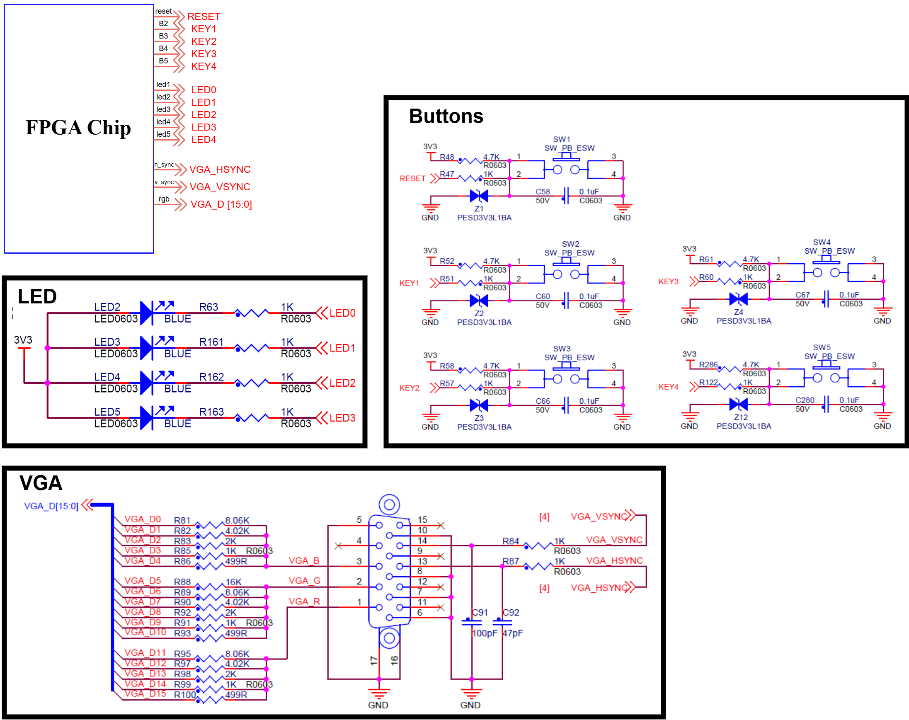

# VGA 模拟器安装与使用手册 / VGA Simulator Installation & Usage Manual

---

## 📑 目录 / Table of Contents

- [VGA 模拟器安装与使用手册 / VGA Simulator Installation \& Usage Manual](#vga-模拟器安装与使用手册--vga-simulator-installation--usage-manual)
  - [📑 目录 / Table of Contents](#-目录--table-of-contents)
  - [1. 简介 / Introduction](#1-简介--introduction)
    - [1.1 模拟器功能 / Simulator Features](#11-模拟器功能--simulator-features)
    - [1.2 系统要求 / System Requirements](#12-系统要求--system-requirements)
  - [4. 工具安装 / Tool Installation](#4-工具安装--tool-installation)
    - [4.1 Ubuntu/Linux 安装步骤 / Ubuntu/Linux Installation](#41-ubuntulinux-安装步骤--ubuntulinux-installation)
      - [4.1.0 安装开发工具 / Install Development Tools](#410-安装开发工具--install-development-tools)
      - [4.1.1 安装所需工具 / Install Required Tools](#411-安装所需工具--install-required-tools)
      - [4.1.2 安装依赖问题排查 / Dependency Troubleshooting](#412-安装依赖问题排查--dependency-troubleshooting)
    - [4.2 验证安装 / Verify Installation](#42-验证安装--verify-installation)
  - [5. 下载模拟器 / Download Simulator](#5-下载模拟器--download-simulator)
  - [6. 使用教程 / Usage Tutorial](#6-使用教程--usage-tutorial)
    - [6.1 了解开发板模块 / Understanding the Development Board](#61-了解开发板模块--understanding-the-development-board)
    - [6.2 准备你的 Verilog 代码 / Preparing Your Verilog Code](#62-准备你的-verilog-代码--preparing-your-verilog-code)
      - [步骤 1：整理文件 / Step 1: Organize Files](#步骤-1整理文件--step-1-organize-files)
      - [步骤 2：添加时标 / Step 2: Add Timescale](#步骤-2添加时标--step-2-add-timescale)
      - [步骤 3：避免使用 IP 核 / Step 3: Avoid IP Cores](#步骤-3避免使用-ip-核--step-3-avoid-ip-cores)
    - [6.3 使用 GUI Launcher / Using GUI Launcher](#63-使用-gui-launcher--using-gui-launcher)
  - [7. 示例项目 / Example Projects](#7-示例项目--example-projects)
    - [7.1 示例 1：彩色条 / Color Bar](#71-示例-1彩色条--color-bar)
    - [7.2 示例 2：移动球 / Ball Movement](#72-示例-2移动球--ball-movement)
  - [8. 故障排除 / Troubleshooting](#8-故障排除--troubleshooting)
    - [8.1 常见问题 / Common Issues](#81-常见问题--common-issues)
      - [Q1: 提示 "verilator: command not found"](#q1-提示-verilator-command-not-found)
      - [Q2: 提示 "SDL.h: No such file"](#q2-提示-sdlh-no-such-file)
      - [Q3: 提示 "Permission denied" 运行脚本时](#q3-提示-permission-denied-运行脚本时)
      - [Q4: 编译成功但窗口黑屏](#q4-编译成功但窗口黑屏)
      - [Q5: 按钮按下没有响应](#q5-按钮按下没有响应)
    - [8.2 错误信息速查 / Quick Error Reference](#82-错误信息速查--quick-error-reference)
  - [9. 结语 / Conclusion](#9-结语--conclusion)
  - [10. 附录 / Appendices](#10-附录--appendices)
    - [Appendix A. 准备工作 / Prerequisites](#a-准备工作--prerequisites)
      - [A.1 Linux 命令行基础 / Linux Command Line Basics](#a1-linux-命令行基础--linux-command-line-basics)
        - [A.1.1 什么是终端？/ What is a Terminal?](#a11-什么是终端-what-is-a-terminal)
        - [A.1.2 如何打开终端？/ How to Open a Terminal?](#a12-如何打开终端-how-to-open-a-terminal)
        - [A.1.3 基础命令详解 / Basic Commands Explained](#a13-基础命令详解--basic-commands-explained)
        - [A.1.4 文件权限基础 / File Permission Basics](#a14-文件权限基础--file-permission-basics)
        - [A.1.5 Linux 路径详解 / Linux Paths Explained](#a15-linux-路径详解--linux-paths-explained)
    - [Appendix B. 系统安装 / System Installation](#b-系统安装--system-installation)
      - [B.1 手动安装方案 / Manual Installation](#b1-手动安装方案--manual-installation)
        - [B.1.1 下载与安装 VirtualBox / Download and Install VirtualBox](#b11-下载与安装-virtualbox--download-and-install-virtualbox)
        - [B.1.2 下载 Ubuntu 镜像 / Download Ubuntu ISO](#b12-下载-ubuntu-镜像--download-ubuntu-iso)
        - [B.1.3 创建虚拟机 / Create Virtual Machine](#b13-创建虚拟机--create-virtual-machine)
        - [B.1.4 安装 Ubuntu / Install Ubuntu](#b14-安装-ubuntu--install-ubuntu)
        - [B.1.5 安装增强功能与设置共享文件夹 / Install Guest Additions \& Shared Folder](#b15-安装增强功能与设置共享文件夹--install-guest-additions--shared-folder)
      - [B.2 Windows 备选方案：WSL / Windows Alternative: WSL](#b2-windows-备选方案wsl--windows-alternative-wsl)

---

## 1. 简介 / Introduction

本手册面向 FPGA 课程学生，详细介绍如何安装和使用 VGA 模拟器。无需购买昂贵的 FPGA 开发板，你就可以在电脑上模拟 VGA 显示效果。

This manual is designed for FPGA course students, providing detailed instructions on how to install and use the VGA simulator. You can simulate VGA display effects on your computer without purchasing expensive FPGA development boards.

### 1.1 模拟器功能 / Simulator Features

| 功能 / Feature | 说明 / Description |
|---------------|-------------------|
| 🖥️ VGA 显示 / VGA Display | 640×480 分辨率，60Hz 刷新率，RGB565 16位彩色 / 640×480 resolution, 60Hz refresh rate, RGB565 16-bit color |
| 🎮 虚拟按键 / Virtual Buttons | 5 个鼠标点击按钮：RESET, B2, B3, B4, B5 / 5 mouse-clickable buttons: RESET, B2, B3, B4, B5 |
| 💡 虚拟 LED / Virtual LEDs | 5 个 LED 输出显示 / 5 LED output indicators |
| ⚡ 实时仿真 / Real-time Simulation | 基于 Verilator + SDL2 / Based on Verilator + SDL2 |

### 1.2 系统要求 / System Requirements

- **推荐 / Recommended**: Ubuntu 22.04 LTS (虚拟机或实体机 / Virtual or Physical Machine)
- **Windows 用户 / Windows Users**: 需安装 VirtualBox 或 WSL2 / Need VirtualBox or WSL2

---

## 4. 工具安装 / Tool Installation


> 📖 **前置知识说明 / Prerequisites Note**: 如果你不熟悉 Linux 命令行或尚未安装操作系统，请参考 [Appendix A：准备工作](#a-准备工作--prerequisites) 和 [Appendix B：系统安装](#b-系统安装--system-installation)。
> If you are not familiar with the Linux command line or have not yet installed an operating system, please refer to [Appendix A: Prerequisites](#a-准备工作--prerequisites) and [Appendix B: System Installation](#b-系统安装--system-installation).

### 4.1 Ubuntu/Linux 安装步骤 / Ubuntu/Linux Installation

#### 4.1.0 安装开发工具 / Install Development Tools

在使用模拟器之前，建议安装以下工具：

Before using the simulator, it is recommended to install the following tools:

**1. VS Code（代码编辑器）**

| 项目 | 内容 |
|------|------|
| 用途 / Purpose | 编辑 Verilog 代码 / Edit Verilog code |
| 下载 / Download | https://code.visualstudio.com/download |
| 安装 / Install | 下载 `.deb` 安装包，双击安装 / Download `.deb`, double-click to install |

**2. GitHub Desktop（可选）/ Optional**

| 项目 | 内容 |
|------|------|
| 用途 / Purpose | 图形化管理代码仓库 / Manage repositories with GUI |
| 说明 / Note | Linux 版本为社区维护 / Community-maintained for Linux |
| 下载 / Download | https://github.com/shiftkey/desktop/releases |

#### 4.1.1 安装所需工具 / Install Required Tools

运行以下命令，按顺序安装所有需要的软件包：

Run the following commands to install all required packages:

```bash
# 1. 更新软件包列表 / Update package list
sudo apt-get update

# 2. 安装编译工具（包含 make、g++、gcc）/ Install build tools (includes make, g++, gcc)
sudo apt-get install build-essential

# 3. 安装 Verilator（Verilog 仿真器）/ Install Verilator (Verilog simulator)
sudo apt-get install verilator

# 4. 安装 SDL2（图形库）/ Install SDL2 (graphics library)
sudo apt-get install libsdl2-dev

# 5. 安装 git（版本控制工具，推荐）/ Install git (version control, recommended)
sudo apt-get install git
```

💡 **安装过程说明 / Installation Process Notes:**
- 运行命令后，系统会询问 "Do you want to continue? [Y/n]"，输入 `Y` 然后回车  
  After running the command, the system will ask "Do you want to continue? [Y/n]", type `Y` and press Enter
- 下载和安装可能需要 5-10 分钟，取决于网络速度  
  Download and installation may take 5-10 minutes depending on network speed
- 看到命令提示符返回，说明安装完成  
  Installation is complete when the command prompt returns

#### 4.1.2 安装依赖问题排查 / Dependency Troubleshooting

如果在安装 `libsdl2-dev` 时遇到如下错误：

If you encounter the following error when installing `libsdl2-dev`:

```bash
libpulse-dev : Depends: libpulse0 (= 1:15.99.1+dfsg1-1ubuntu1) but 1:15.99.1+dfsg1-1ubuntu2.2 is to be installed
libudev-dev : Depends: libudev1 (= 249.11-0ubuntu3.16) but 249.11-0ubuntu3.17 is to be installed
E: Unable to correct problems, you have held broken packages.
```

**原因 / Cause**: The installed library versions on the system are newer, but the development package versions in the default software source are older, causing a version mismatch.

**解决方案 / Solution**: Add the Ubuntu official update sources and reinstall:

```bash
# 添加更新源 / Add update sources
sudo tee -a /etc/apt/sources.list << 'EOF'
deb http://archive.ubuntu.com/ubuntu jammy-updates main universe
deb http://security.ubuntu.com/ubuntu jammy-security main universe
EOF

# 更新并重新安装 / Update and reinstall
sudo apt update
sudo apt install libsdl2-dev
```

### 4.2 验证安装 / Verify Installation

安装完成后，验证所有工具是否正确安装：

After installation, verify all tools are correctly installed:

```bash
# 检查 Verilator 版本 / Check Verilator version
verilator --version
# 预期输出类似：/ Expected output similar to:
# Verilator 4.038 2020-07-11 rev v4.038

# 检查 SDL2 版本 / Check SDL2 version
sdl2-config --version
# 预期输出：/ Expected output:
# 2.0.20 (Ubuntu 22.04) 或更高 / or higher

# 检查 GCC 版本 / Check GCC version
gcc --version
# 预期输出类似：/ Expected output similar to:
# gcc (Ubuntu 11.4.0-1ubuntu1~22.04) 11.4.0

# 检查 Make / Check make
make --version
# 预期输出类似：/ Expected output similar to:
# GNU Make 4.3
```

如果所有命令都返回版本信息，说明安装成功！/ If all commands return version info, installation is successful!

---

## 5. 下载模拟器 / Download Simulator

最简单的方式是直接下载预编译的 GUI Launcher，无需手动配置命令行工具。

The easiest way is to download the pre-built GUI Launcher, no manual CLI configuration needed.

**步骤 / Steps:**

1. **访问 GitHub Releases 页面 / Visit GitHub Releases:**
   https://github.com/pikipity/Simple-VGA-Simulator/releases

2. **下载对应平台的压缩包 / Download the archive for your platform:**

   | 平台 / Platform | 文件 / File | 说明 / Description |
   |----------------|------------|-------------------|
   | Windows | `vga-launcher-windows.zip` | 解压后运行 `.exe` |
   | Linux | `vga-launcher-linux.tar.gz` | 解压后运行可执行文件 |

3. **解压并运行 / Extract and run:**
   - 解压下载的压缩包到任意目录 / Extract the downloaded archive to any directory
   - 双击运行其中的 GUI 程序 / Double-click to launch the GUI application

> 💡 **提示 / Tip**: GUI Launcher 内置了所有必需的仿真模板文件，无需额外下载 `sim/` 文件夹。
> The GUI Launcher includes all necessary simulation template files; no need to download the `sim/` folder separately.

---

## 6. 使用教程 / Usage Tutorial

### 6.1 了解开发板模块 / Understanding the Development Board

`DevelopmentBoard.v` 是连接你的设计和模拟器的桥梁。它定义了：

`DevelopmentBoard.v` is the bridge between your design and the simulator. It defines:

- **输入 / Inputs**: 时钟(clk)、复位(reset)、4 个自定义按键输入(B2-B5)（通过鼠标点击模拟器窗口底部按钮触发）
- **输出 / Outputs**: VGA 信号(h_sync, v_sync, rgb)、5个 LED

**开发板规格 / Development Board Specifications:**

| 参数 / Parameter | 值 / Value | 说明 / Description |
|----------------|-----------|-------------------|
| 系统时钟 / System Clock | 50 MHz | 与实验板相同 / Same as lab board |
| VGA 分辨率 / VGA Resolution | 640×480 | 标准 VGA / Standard VGA |
| 刷新率 / Refresh Rate | 60 Hz | 标准刷新率 / Standard refresh |
| 颜色格式 / Color Format | RGB565 | 16位彩色 / 16-bit color |
| 按键逻辑 / Button Logic | 低电平有效 / Active Low | 按下为 0，松开为 1 / 0 when pressed, 1 when released |

**开发板原理图 / Development Board Schematic:**



**按钮映射 / Button Mapping:**

仿真器窗口底部显示 5 个正方形按钮，点击即可触发对应信号：

The simulator window displays 5 square buttons at the bottom. Click to trigger the corresponding signal:

| 按钮 / Button | 信号 / Signal | 功能 / Function |
|--------------|--------------|----------------|
| **RESET** | reset | 系统复位 / System reset |
| **B2** | B2 | 自定义按键 2 / Custom button 2 |
| **B3** | B3 | 自定义按键 3 / Custom button 3 |
| **B4** | B4 | 自定义按键 4 / Custom button 4 |
| **B5** | B5 | 自定义按键 5 / Custom button 5 |

> 按住按钮时信号为 0（低电平有效），松开时信号为 1。鼠标拖出按钮区域会自动释放。  
> Hold to activate (signal = 0, active low), release to deactivate (signal = 1). Dragging outside auto-releases.

### 6.2 准备你的 Verilog 代码 / Preparing Your Verilog Code

#### 步骤 1：整理文件 / Step 1: Organize Files

创建一个项目文件夹，结构如下：/ Create a project folder with this structure:

```
MyVGAProject/
└── RTL/                        # 存放你的 Verilog 代码 / Store your Verilog code
    ├── my_vga_module.v
    ├── vga_controller.v
    └── ...
```

> 💡 **提示 / Tip**: `sim/` 文件夹会在你点击"一键运行仿真"时由 GUI 自动生成，无需手动创建。  
> The `sim/` folder will be automatically generated by the GUI when you click "Run Simulation", no need to create it manually.

#### 步骤 2：添加时标 / Step 2: Add Timescale

**重要！/ Important!** 所有 `.v` 文件开头必须添加时标指令：  
All `.v` files must include the timescale directive at the beginning:

```verilog
`timescale 1ns / 1ns

module my_module (
    // ...
);
```

#### 步骤 3：避免使用 IP 核 / Step 3: Avoid IP Cores

模拟器**不支持**任何厂商 IP 核（如 PLL、RAM 块等）。如果你使用了这些，需要自己实现替代模块。

The simulator **does not support** vendor IP cores (such as PLL, RAM blocks, etc.). If you use these, you need to implement replacement modules yourself.

**常见替换方案 / Common Replacement Solutions:**

```verilog
// 不要用 PLL 生成时钟 / Don't use PLL for clock generation:
// 改用简单的时钟分频器 / Use simple clock divider instead:
reg vga_clk;
always @(posedge sys_clk or negedge sys_rst_n) begin
    if (!sys_rst_n)
        vga_clk <= 0;
    else
        vga_clk <= ~vga_clk;  // 50MHz -> 25MHz
end
```

### 6.3 使用 GUI Launcher / Using GUI Launcher

GUI Launcher 会自动完成信号映射、`DevelopmentBoard.v` 生成和仿真运行，无需手动配置。

The GUI Launcher automatically handles signal mapping, `DevelopmentBoard.v` generation, and simulation execution without manual configuration.

**步骤 / Steps:**

1. **打开 GUI / Launch GUI**
   - 双击运行下载的 GUI 程序
   - Double-click to launch the GUI application

2. **选择项目目录 / Select Project Directory**
   - 点击"浏览..."按钮，选择包含 `.v` 文件的文件夹
   - Click "Browse..." and select the folder containing your `.v` files
   - 例如 / For example: `~/Projects/MyVGAProject`

3. **选择 Top Module / Select Top Module**
   - 从下拉框中选择你的顶层 Verilog 模块
   - Select your top-level Verilog module from the dropdown
   - 如 `ColorBar`、`Simple_VGA` 或你自己的模块 / Such as `ColorBar`, `Simple_VGA`, or your own module

4. **信号映射 / Signal Mapping**
   - GUI 会自动根据命名规则推断映射关系（如 `sys_clk` → `clk`，`rst_n` → `reset`）
   - The GUI automatically infers mappings based on naming conventions
   - **检查每个信号**是否正确映射，手动调整错误的映射
   - **Check each signal** and manually correct any incorrect mappings

   | 你的模块信号 / Your Signal | 开发板信号 / Board Signal | 说明 / Description |
   |-------------------------|------------------------|-------------------|
   | `sys_clk`, `clk` | `clk` | 50MHz 系统时钟 / System clock |
   | `sys_rst_n`, `rst_n` | `reset` | 复位（低电平有效）/ Reset (active low) |
   | `hsync` | `h_sync` | 水平同步 / Horizontal sync |
   | `vsync` | `v_sync` | 垂直同步 / Vertical sync |
   | `rgb` | `rgb` | RGB565 颜色输出 / RGB565 color output |
   | `B2` | `B2` | 自定义按键 2 / Custom button 2 |
   | `B3` | `B3` | 自定义按键 3 / Custom button 3 |
   | `B4` | `B4` | 自定义按键 4 / Custom button 4 |
   | `B5` | `B5` | 自定义按键 5 / Custom button 5 |
   | `led1` ~ `led5` | `led1` ~ `led5` | LED 输出 / LED outputs |

5. **🚀 一键运行 / One-Click Run**
   - 点击"一键运行仿真"按钮
   - Click the "Run Simulation" button
   - GUI 会自动执行以下操作：/ The GUI will automatically:
     - 创建 `sim/` 工作目录 / Create the `sim/` workspace
     - 复制仿真模板文件（`simulator.cpp`、`run_simulation.sh`）/ Copy simulation templates
     - 生成 `DevelopmentBoard.v`（自动实例化你的模块）/ Generate `DevelopmentBoard.v`
     - 调用 Verilator 编译 / Invoke Verilator compilation
     - 启动 SDL2 仿真窗口 / Launch the SDL2 simulation window

6. **查看日志 / View Logs**
   - 编译和运行过程中的输出会显示在 GUI 的日志控制台中
   - Output during compilation and execution is shown in the GUI log console
   - 日志同时保存到 `<项目目录>/sim/sim.log`
   - Logs are also saved to `<project_dir>/sim/sim.log`

---

## 7. 示例项目 / Example Projects

模拟器包含两个示例项目，建议先运行这些示例验证环境配置正确。

The simulator includes two example projects. We recommend running these first to verify your environment setup.

### 7.1 示例 1：彩色条 / Color Bar

1. **打开 GUI Launcher / Open GUI Launcher**

2. **选择项目目录 / Select Project Directory:**
   - 选择 `Simple-VGA-Simulator/Example/Example_1_ColorBar/RTL`

3. **选择 Top Module / Select Top Module:**
   - 选择 `ColorBar`

4. **点击"🚀 一键运行仿真" / Click "Run Simulation"**

5. **预期结果 / Expected Result:**
   - 窗口显示垂直彩色条（红、绿、蓝等颜色）/ Window displays vertical color bars (red, green, blue, etc.)

### 7.2 示例 2：移动球 / Ball Movement

1. **打开 GUI Launcher / Open GUI Launcher**

2. **选择项目目录 / Select Project Directory:**
   - 选择 `Simple-VGA-Simulator/Example/Example_2_BallMove/RTL`

3. **选择 Top Module / Select Top Module:**
   - 选择 `Simple_VGA`

4. **点击"🚀 一键运行仿真" / Click "Run Simulation"**

5. **预期结果 / Expected Result:**
   - 紫色背景上的蓝色小球 / Blue ball on purple background
   - 点击底部 **B2** / **B3** / **B4** / **B5** 按钮移动小球 / Click the **B2** / **B3** / **B4** / **B5** buttons at the bottom to move the ball
   - 对应 LED 会亮起 / Corresponding LEDs light up

---

## 8. 故障排除 / Troubleshooting

### 8.1 常见问题 / Common Issues

#### Q1: 提示 "verilator: command not found"

**原因 / Cause**: Verilator 未安装或不在 PATH 中  
**解决 / Solution**:
```bash
# Ubuntu
sudo apt-get install verilator
```

#### Q2: 提示 "SDL.h: No such file"

**原因 / Cause**: SDL2 库未安装  
**解决 / Solution**:
```bash
# Ubuntu
sudo apt-get install libsdl2-dev
```

#### Q3: 提示 "Permission denied" 运行脚本时

**原因 / Cause**: 脚本没有执行权限  
**解决 / Solution**:
```bash
chmod +x run_simulation.sh
```

#### Q4: 编译成功但窗口黑屏

**原因 / Cause**: VGA 时序参数不正确  
**解决 / Solution**: 检查你的 VGA 控制器时序是否符合 640×480@60Hz 标准：  
Check if your VGA controller timing matches the 640×480@60Hz standard:

| 参数 / Parameter | 值 / Value |
|----------------|-----------|
| H_SYNC | 96 cycles |
| H_BACK | 40 cycles |
| H_LEFT | 8 cycles |
| H_VALID | 640 cycles |
| H_RIGHT | 8 cycles |
| H_FRONT | 8 cycles |
| H_TOTAL | 800 cycles |
| V_SYNC | 2 lines |
| V_BACK | 25 lines |
| V_TOP | 8 lines |
| V_VALID | 480 lines |
| V_BOTTOM | 8 lines |
| V_FRONT | 2 lines |
| V_TOTAL | 525 lines |

#### Q5: 按钮按下没有响应

**原因 / Cause**: 按钮逻辑可能不正确  
**解决 / Solution**: 确保你的设计使用低电平有效逻辑（按下为 0）  
Ensure your design uses active-low logic (pressed = 0):
```verilog
// 正确 / Correct
input wire B2,  // 按下时 B2 = 0 / B2 = 0 when pressed

// 在你的模块中 / In your module:
always @(posedge clk) begin
    if (!B2)  // 检测按钮按下 / Detect button press
        // ...
end
```

### 8.2 错误信息速查 / Quick Error Reference

| 错误 / Error | 可能原因 / Likely Cause | 解决 / Solution |
|------------|----------------------|----------------|
| `obj_dir/VDevelopmentBoard.mk: No such file` | Verilation 失败 / Verilation failed | 检查 Verilog 语法 / Check Verilog syntax |
| `undefined reference to 'SDL_Init'` | SDL2 链接错误 / SDL2 linking error | 重新安装 SDL2 库 / Reinstall SDL2 libraries |
| `syntax error, unexpected xxx` | Verilog 语法错误 / Verilog syntax error | 检查代码语法 / Check code syntax |
| `Cannot find file: xxx.v` | 文件路径错误 / File path error | 检查 RTL 路径参数 / Check RTL path argument |

---

## 9. 结语 / Conclusion

如果在使用过程中遇到任何问题，请：/ If you encounter any issues during use, please:

1. 仔细检查本手册相关章节 / Carefully check the relevant sections of this manual
2. 查看终端的错误信息 / Look at the terminal error messages
3. 向课程助教或老师寻求帮助 / Seek help from course TAs or instructors

祝学习顺利！/ Happy learning!

---

## 10. 附录 / Appendices

## Appendix A. 准备工作 / Prerequisites

### A.1 Linux 命令行基础 / Linux Command Line Basics

> ⚠️ **重要提示 / Important**: 即使你从未使用过 Linux，也不用担心！以下基础命令足以完成本课程的所有操作。  
> Don't worry if you've never used Linux before! The following basic commands are sufficient for all operations in this course.

#### A.1.1 什么是终端？/ What is a Terminal?

终端（Terminal）是一个可以通过输入命令来控制电脑的程序。在 Windows 上你可能习惯使用图形界面点击操作，而在 Linux 中，很多操作通过输入命令更加高效。

A terminal is a program that allows you to control your computer by typing commands. While you may be used to clicking through graphical interfaces on Windows, many operations are more efficient through command input in Linux.

#### A.1.2 如何打开终端？/ How to Open a Terminal?

**Ubuntu 中打开终端的三种方法 / Three ways to open a terminal in Ubuntu:**

1. **快捷键 / Keyboard Shortcut**: 按 `Ctrl` + `Alt` + `T`
2. **应用程序菜单 / Applications Menu**: 点击左下角的"Show Applications"（九宫格图标），搜索 "terminal"
3. **右键菜单 / Right-click Menu**: 在桌面或文件夹空白处右键 → "Open in Terminal"

#### A.1.3 基础命令详解 / Basic Commands Explained

打开终端后，你会看到一个提示符（prompt），通常长这样：

After opening the terminal, you will see a prompt that typically looks like this:

```
username@computer-name:~$
```

- `username`: 你的用户名 / Your username
- `computer-name`: 计算机名称 / Computer name
- `~`: 当前所在目录（`~` 表示用户主目录 / home directory）
- `$`: 表示普通用户权限（`#` 表示管理员权限 / administrator privilege）

**必备命令 / Essential Commands:**

| 命令 / Command | 全称 / Full Name | 功能 / Function | 示例 / Example |
|--------------|-----------------|----------------|---------------|
| `pwd` | Print Working Directory | 显示当前所在路径 / Show current path | `pwd` |
| `ls` | List | 列出当前目录的文件 / List files in current directory | `ls`, `ls -la` |
| `cd` | Change Directory | 切换目录 / Change directory | `cd Documents`, `cd ..`, `cd ~` |
| `mkdir` | Make Directory | 创建新文件夹 / Create new folder | `mkdir my_project` |
| `cp` | Copy | 复制文件 / Copy file | `cp file.txt backup.txt` |
| `mv` | Move | 移动或重命名文件 / Move or rename file | `mv old.txt new.txt` |
| `rm` | Remove | 删除文件（⚠️ 小心使用！/ use with caution!） | `rm file.txt` |
| `cat` | Concatenate | 查看文件内容 / View file content | `cat README.md` |
| `chmod` | Change Mode | 修改文件权限 / Change file permissions | `chmod +x script.sh` |
| `sudo` | Superuser Do | 以管理员权限执行 / Execute with admin privileges | `sudo apt update` |

**命令详解 / Detailed Command Usage:**

```bash
# 1. pwd - 查看我在哪里 / See where you are
$ pwd
/home/username/Documents

# 2. ls - 查看周围有什么 / See what's around you
$ ls                    # 简单列表 / Simple list
$ ls -l                 # 详细列表（带权限、大小等）/ Detailed list
$ ls -a                 # 显示隐藏文件（以.开头的文件）/ Show hidden files
$ ls -la                # 详细+隐藏文件 / Detailed + hidden

# 3. cd - 移动到另一个文件夹 / Move to another folder
$ cd Documents          # 进入 Documents 文件夹 / Enter Documents folder
$ cd ..                 # 返回上一级目录 / Go to parent directory
$ cd ~                  # 返回主目录 / Go to home directory
$ cd /                  # 返回根目录 / Go to root directory
$ cd -                  # 返回刚才的目录 / Go to previous directory

# 4. mkdir - 创建文件夹 / Create a folder
$ mkdir MyProject       # 创建 MyProject 文件夹 / Create MyProject folder
$ mkdir -p a/b/c        # 创建多级文件夹 / Create nested folders

# 5. cp - 复制 / Copy
$ cp file.txt backup.txt           # 复制文件 / Copy file
$ cp -r folder1 folder2            # 复制整个文件夹（-r = recursive）/ Copy entire folder

# 6. mv - 移动或重命名 / Move or rename
$ mv old_name.txt new_name.txt     # 重命名 / Rename
$ mv file.txt /home/user/Desktop/  # 移动到其他位置 / Move to another location

# 7. rm - 删除（⚠️ 删除后无法恢复！/ Cannot be recovered after deletion!）
$ rm file.txt                      # 删除文件 / Delete file
$ rm -r folder/                    # 删除文件夹 / Delete folder
$ rm -rf folder/                   # 强制删除（慎用！/ Use with extreme caution!）
```

💡 **提示 / Tip**: 使用 `Tab` 键可以自动补全文件名，避免输入错误！  
Use the `Tab` key to auto-complete filenames and avoid typing errors!

```bash
$ cd Doc<Tab>    # 会自动补全为 Documents / Will auto-complete to Documents
```

#### A.1.4 文件权限基础 / File Permission Basics

在 Linux 中，每个文件都有权限设置，决定谁能读取、写入或执行它。

In Linux, every file has permission settings that determine who can read, write, or execute it.

```bash
# 查看文件权限 / View file permissions
$ ls -l run_simulation.sh
-rw-r--r-- 1 user user 1064 Jan 15 10:30 run_simulation.sh
#  ^^^^^^^^
#  权限部分 / Permission section
```

权限字符串解释 / Permission string explanation:
- 第1位：文件类型（`-` 文件，`d` 目录）/ File type (`-` file, `d` directory)
- 第2-4位：所有者权限 / Owner permissions (`rwx` = 读/写/执行 / read/write/execute)
- 第5-7位：组权限 / Group permissions
- 第8-10位：其他用户权限 / Others permissions

```bash
# 添加执行权限（让脚本可以运行）/ Add execute permission (to run scripts)
$ chmod +x run_simulation.sh

# 现在权限变为 / Now permissions become: -rwxr-xr-x
# 其中的 x 表示可执行 / The x indicates executable
```

#### A.1.5 Linux 路径详解 / Linux Paths Explained

在 Linux 中，有两种路径表示方式：/ In Linux, there are two ways to represent paths:

**1. 绝对路径 / Absolute Path**

从根目录 `/` 开始的完整路径。无论你在哪里，绝对路径都指向同一个位置。  
A complete path starting from the root directory `/`. No matter where you are, an absolute path points to the same location.

```
/home/username/Documents/project/file.txt
/etc/apt/sources.list
/usr/bin/verilator
```

**2. 相对路径 / Relative Path**

相对于当前目录的路径。随着你所在位置变化，指向的位置也会变化。  
A path relative to the current directory. As your location changes, the destination changes too.

```
documents/file.txt       # 当前目录下的 documents 文件夹 / documents folder in current directory
../config/settings.txt   # 上级目录的 config 文件夹 / config folder in parent directory
./script.sh              # 当前目录的 script.sh / script.sh in current directory
```

**特殊路径符号 / Special Path Symbols:**

| 符号 / Symbol | 含义 / Meaning | 示例 / Example |
|-------------|--------------|---------------|
| `/` | 根目录 / Root directory | `cd /` |
| `~` | 用户主目录 / User home directory | `cd ~`, `~/Documents` |
| `.` | 当前目录 / Current directory | `./run.sh` |
| `..` | 上级目录 / Parent directory | `cd ..`, `../RTL` |

**实例演示 / Practical Examples:**

```bash
# 假设当前位置 / Assume current location:
$ pwd
/home/student/Projects/MyVGA/sim

# 1. 使用绝对路径到 RTL 文件夹 / Use absolute path to RTL folder:
$ ./run_simulation.sh /home/student/Projects/MyVGA/RTL

# 2. 使用相对路径到 RTL 文件夹（上级目录）/ Use relative path to RTL folder (parent directory):
$ ./run_simulation.sh ../RTL

# 3. 从 sim 到 Downloads 文件夹 / From sim to Downloads folder:
$ cd ~/Downloads
# 或使用绝对路径 / Or use absolute path:
$ cd /home/student/Downloads

# 4. 快速回到项目 / Quickly return to project:
$ cd ~/Projects/MyVGA/sim
```

**路径使用建议 / Path Usage Tips:**

1. **脚本中使用绝对路径 / Use absolute paths in scripts**: 确保无论在哪里运行都能找到文件  
   Ensures files can be found regardless of where the script runs from

2. **日常操作使用相对路径 / Use relative paths for daily operations**: 更短、更方便  
   Shorter and more convenient

3. **使用 Tab 补全避免错误 / Use Tab completion to avoid errors**:  
   ```bash
   $ cd /home/stu<Tab>    # 补全为 student / Completes to student
   $ cd Pro<Tab>          # 补全为 Projects / Completes to Projects
   ```

## Appendix B. 系统安装 / System Installation

### B.1 手动安装方案 / Manual Installation

> 按照以下步骤手动配置 Linux 环境。
> 
> Follow these steps to manually configure the Linux environment.

#### B.1.1 下载与安装 VirtualBox / Download and Install VirtualBox

**步骤 / Steps:**

1. 访问官网 / Visit official website: https://www.virtualbox.org/wiki/Downloads

2. 下载 Windows 版本的安装程序 / Download the Windows installer:
   - `VirtualBox-7.x.x-Win.exe`

> 🐧 **Linux 用户注意 / Linux Users Note**:  
> Linux 用户可以直接在原生 Linux 系统上运行模拟器，无需安装虚拟机。直接跳到 [Section 4 工具安装](#4-工具安装--tool-installation) 安装所需工具即可。  
> Linux users can run the simulator directly on native Linux without installing a virtual machine. Skip to [Section 4 Tool Installation](#4-工具安装--tool-installation) to install required tools.

3. 运行安装程序，按提示完成安装 / Run the installer and follow the prompts

#### B.1.2 下载 Ubuntu 镜像 / Download Ubuntu ISO

推荐使用 **Ubuntu 22.04 LTS**（长期支持版本）：

We recommend **Ubuntu 22.04 LTS** (Long Term Support):

1. 访问 / Visit: https://ubuntu.com/download/desktop
2. 下载 `ubuntu-22.04.x-desktop-amd64.iso`
3. 文件大小约 / File size: ~4-5 GB

#### B.1.3 创建虚拟机 / Create Virtual Machine

**详细步骤 / Detailed Steps:**

1. 打开 VirtualBox，点击 "New"（新建）

2. 配置虚拟机 / Configure VM:
   ```
   Name: Ubuntu-VGA-Sim
   Folder: 选择一个有足够空间的文件夹（建议至少 30GB）/ Choose folder with enough space (recommend 30GB+)
   ISO Image: 选择下载的 Ubuntu ISO 文件 / Select downloaded Ubuntu ISO
   Type: Linux
   Version: Ubuntu (64-bit)
   ```

3. 硬件配置 / Hardware configuration:
   ```
   Base Memory: 4096 MB (4GB) 或更多 / or more
   Processors: 2 核或更多 / cores or more
   ```

4. 虚拟硬盘 / Virtual Hard Disk:
   ```
   Create a Virtual Hard Disk Now: Yes
   Disk Size: 25.00 GB (建议 / Recommended: 30GB)
   Hard Disk File Type: VDI (VirtualBox Disk Image)
   Storage: Dynamically allocated（动态分配，节省空间 / dynamically allocated, saves space）
   ```

5. 点击 "Finish"，虚拟机创建完成 / Click "Finish" to complete VM creation

#### B.1.4 安装 Ubuntu / Install Ubuntu

1. 选中虚拟机，点击 "Start" / Select the VM and click "Start"

2. 选择 "Try or Install Ubuntu" / Select "Try or Install Ubuntu"

3. 语言选择 / Language selection: 
   - 可以选择 "中文(简体)" 或 "English"
   - 推荐初学者使用中文界面 / Beginners are recommended to use the Chinese interface

4. 键盘布局 / Keyboard layout: 选择 "Chinese" 或 "English (US)"

5. 更新和其他软件 / Updates and other software:
   - 选择 "正常安装" (Normal installation)
   - 勾选 "安装第三方软件" (Install third-party software)

6. 安装类型 / Installation type:
   - 选择 "清除整个磁盘并安装 Ubuntu" (Erase disk and install Ubuntu)
   - ⚠️ 不用担心，这只影响虚拟磁盘，不影响你的主机！/ Don't worry, this only affects the virtual disk!

7. 选择时区 / Select timezone: Shanghai (或你所在的城市 / or your city)

8. 创建用户 / Create user:
   ```
   姓名 / Your name: [你的名字 / Your name]
   计算机名 / Computer name: ubuntu-vga
   用户名 / Username: student
   密码 / Password: [设置一个密码 / Set a password]
   确认密码 / Confirm password: [重复密码 / Repeat password]
   选择 "需要密码才能登录" (Require my password to log in)
   ```

9. 等待安装完成（约 10-20 分钟）/ Wait for installation (about 10-20 minutes)

10. 重启虚拟机 / Restart VM

#### B.1.5 安装增强功能与设置共享文件夹 / Install Guest Additions & Shared Folder

共享文件夹让你可以在 Windows 和 Ubuntu 之间方便地传输文件。

Shared folders allow convenient file transfer between Windows and Ubuntu.

**安装 VirtualBox Guest Additions / Install VirtualBox Guest Additions:**

1. 启动 Ubuntu 虚拟机 / Start the Ubuntu virtual machine

2. 登录后，在 VirtualBox 菜单栏点击 / After login, click in VirtualBox menu:
   ```
   Devices → Insert Guest Additions CD Image...
   ```

3. Ubuntu 中会弹出光盘图标，双击打开 / CD icon appears in Ubuntu, double-click to open

4. 右键点击空白处 → "Open in Terminal" / Right-click → "Open in Terminal"

5. 运行安装脚本 / Run installation script:
   ```bash
   sudo ./VBoxLinuxAdditions.run
   ```

6. 输入密码，等待安装完成 / Enter password, wait for completion

7. 重启虚拟机 / Restart VM: `sudo reboot`

8. 验证 Guest Additions 服务是否运行 / Verify Guest Additions service is running:
   ```bash
   sudo systemctl status vboxadd-service
   ```
   如果看到 `active (running)`，说明安装成功。/ If you see `active (running)`, the installation was successful.

**设置共享文件夹 / Setup Shared Folder:**

1. 在 VirtualBox 主界面，选中虚拟机，点击 "Settings" / In the VirtualBox main window, select the VM and click "Settings"

2. 选择 "Shared Folders" → 点击右侧 "+" 按钮 / Select "Shared Folders" → Click the "+" button on the right

3. 配置共享文件夹 / Configure:
   ```
   Folder Path: 选择 Windows 上的一个文件夹 / Select a folder on Windows
   Folder Name: shared
   勾选 / Check: Auto-mount
   勾选 / Check: Make Permanent
   ```

4. 启动虚拟机，在终端中运行：/ Start VM, run in terminal:
   ```bash
   # 将你自己添加到 vboxsf 组 / Add yourself to vboxsf group
   sudo usermod -aG vboxsf $USER
   
   # 重启以生效 / Restart to take effect
   sudo reboot
   ```

5. 重启后，共享文件夹会出现在 /media/sf_shared / After restart, shared folder appears at /media/sf_shared

6. 创建快捷方式方便访问 / Create shortcut for easy access:
   ```bash
   ln -s /media/sf_shared ~/shared
   ```

   现在你可以在主目录看到 "shared" 文件夹，这就是你的共享文件夹！  
   Now you can see "shared" folder in home directory - this is your shared folder!

### B.2 Windows 备选方案：WSL / Windows Alternative: WSL

> 💡 **适用于 / For**: Windows 10/11 用户，希望不使用虚拟机运行 Linux 的用户  
> Windows 10/11 users who want to run Linux without a virtual machine

WSL 是 Windows 10/11 自带的 Linux 子系统，无需虚拟机即可运行 Linux。

WSL is a Linux subsystem built into Windows 10/11, allowing Linux to run without a virtual machine.

> ⚠️ **注意 / Note**: WSL 配置较为复杂。如果你不熟悉命令行，强烈推荐使用 Section 3.1 VirtualBox 方案。
> 
> WSL configuration is more complex. If you're not familiar with command line, we strongly recommend Section 3.1 VirtualBox approach.

**安装步骤简述 / Brief Installation Steps:**

1. 以管理员身份打开 PowerShell，运行：/ Open PowerShell as administrator, run:
   ```powershell
   wsl --install -d Ubuntu-22.04
   ```

2. 重启电脑 / Restart computer

3. 设置 Ubuntu 用户名和密码 / Set Ubuntu username and password

4. 安装 Xming 用于显示图形界面 / Install Xming for GUI:
   - 下载 / Download: https://sourceforge.net/projects/xming/
   - 安装并运行 Xming
   - 在 Ubuntu 中设置环境变量：/ Set environment variable in Ubuntu:
     ```bash
     echo 'export DISPLAY=:0.0' >> ~/.bashrc
     source ~/.bashrc
     ```

