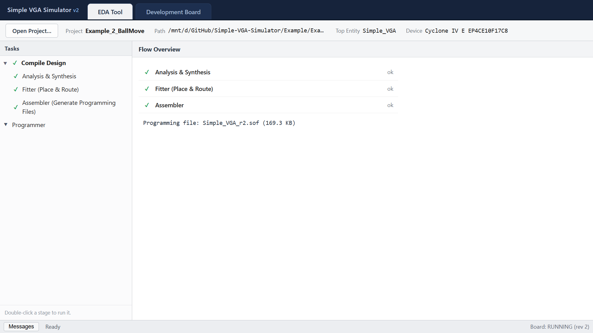
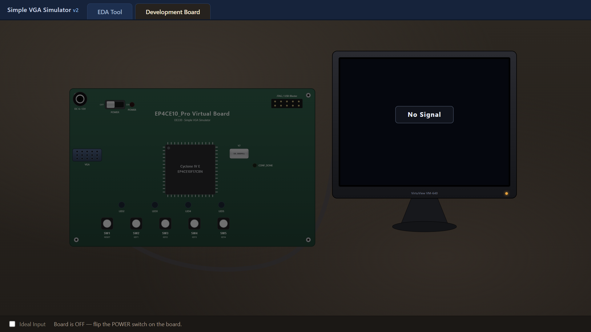
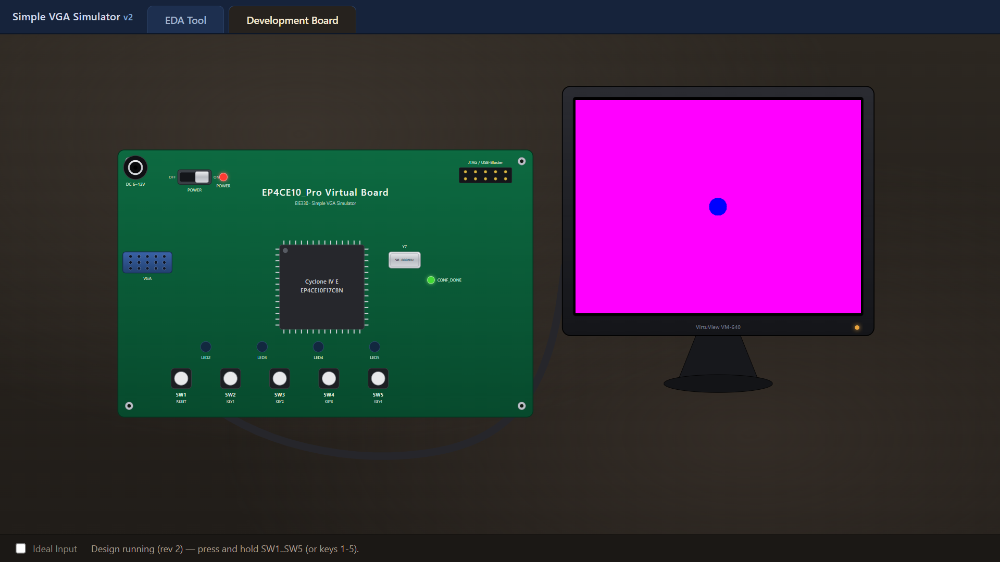

# Simple VGA Simulator v2 学生手册 / Student Manual

> **EIE330 · 虚拟 FPGA 开发板实验台 / Virtual FPGA Development Board Lab Bench**

本手册面向 EIE330 课程学生，介绍 v2 版虚拟开发板实验台的安装与使用。软件在你的电脑浏览器里提供一套仿 Quartus Prime 的 EDA 工具和一块仿真实物布局的虚拟开发板——无需购买 FPGA 开发板，就可以在宿舍里完成与实验室一致的完整开发流程。

This manual is for EIE330 students. Version 2 of the simulator gives you two things in your browser: a Quartus Prime style EDA tool and a realistic virtual development board. You get the full lab workflow at home, without buying any hardware.

## 目录 / Table of Contents

1. [简介 / Introduction](#1-简介--introduction)
2. [安装工具链 / Install the Toolchain](#2-安装工具链--install-the-toolchain)
3. [获取并启动软件 / Get and Launch the Software](#3-获取并启动软件--get-and-launch-the-software)
4. [快速上手：跑通第一个示例 / Quick Start: Run the First Example](#4-快速上手跑通第一个示例--quick-start-run-the-first-example)
5. [开发板 / The Development Board](#5-开发板--the-development-board)
6. [完整工作流程 / The Full Workflow](#6-完整工作流程--the-full-workflow)
7. [QSF 引脚约束参考 / QSF Pin Constraint Reference](#7-qsf-引脚约束参考--qsf-pin-constraint-reference)
8. [Verilog 编写注意事项 / Verilog Coding Notes](#8-verilog-编写注意事项--verilog-coding-notes)
9. [故障排除 / Troubleshooting](#9-故障排除--troubleshooting)
10. [结语 / Conclusion](#10-结语--conclusion)

---

## 1. 简介 / Introduction

### 1.1 这个软件是什么 / What This Software Is

v2 版模拟器是一套**虚拟 FPGA 开发板实验台**（virtual development board lab bench）。启动软件后，你的浏览器里会出现两样独立的东西：

1. **一套仿 Quartus Prime 的 EDA 工具**——工程、编译流程、时序报告、引脚规划、编程器，一应俱全
2. **一块仿真实物布局的虚拟开发板**——Cyclone IV E 芯片、晶振、按键、LED、VGA 接口外接显示器、电源开关

你体验的流程与真实实验完全一致：写 Verilog → 写 QSF 引脚约束 → Analysis & Synthesis → Fitter（时序报告）→ Assembler（生成 .sof 烧录文件）→ Programmer（USB-Blaster 烧录）→ 上电 → 按按键看现象。

The simulator consists of two separate things, exactly like in a real lab: (1) a Quartus Prime style EDA tool for the whole compile-and-program flow, and (2) a virtual development board with the same resources as the real one. Your workflow — Verilog, QSF pin constraints, synthesis, fitter, assembler, programmer, power on, press buttons — matches the real lab one to one.

> 底层用什么技术实现（仿真引擎、编译工具链）对你是透明的：你只需要像使用真实 Quartus + 真实开发板一样使用它。
>
> The implementation underneath is transparent to you — just use it as if it were the real Quartus and a real board.

### 1.2 两个页面 / The Two Pages

软件由**两个独立页面**组成，页面顶部有标签互相切换（EDA Tool / Development Board）。两页共享同一份状态：你在 EDA 页烧录，板子页立刻反应。

- **页面 A「EDA Tool」**：仿 Quartus 界面。顶部是工程栏（工程路径、Top Entity、器件 `Cyclone IV E EP4CE10F17C8`）；左侧是 Tasks 流程树（Compile Design → Analysis & Synthesis / Fitter (Place & Route) / Assembler，外加 Programmer）；中间是报告区（Flow Summary / Pin-Out / Timing Summary / Pin Planner / Programmer）。Messages 平时收在底部状态栏的一个按钮里，编译出错时角标变红，点开查看。

  

- **页面 B「Development Board」**：实物摆拍视角，整页是一块板子加一台用 VGA 线连接的独立显示器。**首次进入默认断电**——和拿到一块真板子一样，你要先拨电源开关。

  

### 1.3 系统要求 / System Requirements

- **操作系统 / OS**：Windows 10/11、macOS、主流 Linux 发行版
- **浏览器 / Browser**：Chrome、Edge、Firefox、Safari 等现代浏览器
- **工具链 / Toolchain**：verilator、yosys、g++ 三个命令行工具（第 2 章，这是你唯一要装的东西）
- **软件本体 / The app itself**：打包版自带 Python 运行时；源码方式运行需要 Python ≥ 3.9（零第三方依赖）

**不再需要 / No longer needed**：虚拟机、WSL、SDL2、make、Flutter、Qt——全部不需要。

---

## 2. 安装工具链 / Install the Toolchain

学生侧需要安装的只有三个外部工具，安装方式按平台如下。软件在编译时会自动检查工具链（是否安装、版本是否达标、能否正常工作），检查不通过时编译会失败，错误出现在 Messages 里。

### 2.1 Linux（Ubuntu / Debian）

```bash
sudo apt update
sudo apt install verilator yosys g++
```

### 2.2 macOS

1. 安装 Xcode Command Line Tools（提供 g++ 编译器）：

   ```bash
   xcode-select --install
   ```

2. 安装 Homebrew（如未安装，见 https://brew.sh ），然后：

   ```bash
   brew install verilator yosys
   ```

### 2.3 Windows（MSYS2）

1. 从 https://www.msys2.org/ 下载并安装 MSYS2
2. 打开 **MSYS2 MinGW 64-bit** 终端，运行：

   ```bash
   pacman -Syu
   pacman -S mingw-w64-x86_64-verilator mingw-w64-x86_64-gcc mingw-w64-x86_64-yosys
   ```

3. 把 `C:\msys64\mingw64\bin`（MSYS2 装在别处则按实际路径调整）加入 Windows 的 PATH 系统环境变量，然后**重新打开**你的软件（或注销重登），让新 PATH 生效。

### 2.4 验证安装 / Verify Installation

在终端里依次运行：

```bash
verilator --version   # 需要 4.0 或更高
yosys --version       # 需要 0.9 或更高
g++ --version         # 需要 7.0 或更高
```

三条命令都能打印出版本号即安装成功。

> 最常见的坑：Windows 装完 MSYS2 忘了把 `mingw64\bin` 加进 PATH，导致编译时报「找不到工具 verilator / g++ / yosys」。

---

## 3. 获取并启动软件 / Get and Launch the Software

### 3.1 从 GitHub Releases 下载（推荐）

1. 打开仓库的 GitHub Releases 页面
2. 下载对应平台的压缩包
3. 解压到任意目录

### 3.2 从源码运行

```bash
python main.py
```

要求 Python ≥ 3.9；不需要安装任何第三方 Python 包（只用标准库）。

### 3.3 启动之后 / After Launch

- **双击启动**（打包版）或运行 `python main.py` 后：本地服务在本机启动，**浏览器自动打开 EDA Tool 页**
- 启动时会弹出一个控制台/终端窗口，里面打印两个页面的地址和日志文件位置；**不要关掉它**——关掉它就是退出软件
- 页面顶部标签在 **EDA Tool** 与 **Development Board** 之间切换
- 软件**空闲 120 秒（无任何操作）会自动退出**，这是省资源的设计；重新双击启动即可，板子状态本来就不会跨启动保留

---

## 4. 快速上手：跑通第一个示例 / Quick Start: Run the First Example

用示例工程 `Example/Example_1_ColorBar`（彩色条纹，无按键交互）走一遍全流程，验证环境配置正确：

1. 启动软件，浏览器打开 EDA Tool 页
2. 点击左上角 **Open Project…**，在目录浏览器里找到 `Example/Example_1_ColorBar`（带 `QSF ✓` 标记的文件夹），双击进入后点 **Select This Folder**
3. 在左侧 Tasks 里双击 **Compile Design**（或其 ▶ 按钮）：自动依次执行 Analysis & Synthesis → Fitter (Place & Route) → Assembler，三步全部变绿
4. 切到 **Development Board** 页，拨 **POWER** 开关到 ON：红色电源灯亮起（此时 FPGA 还未配置，页面下方会提示 Powered, but FPGA not configured）
5. 切回 EDA Tool 页，点 Tasks 里的 **Programmer** → **Start**：进度条依次经过 connecting → erasing → programming → verifying，最后显示 **100% — Configuration successful (CONF_DONE)**
6. 切回 Development Board 页：CONF_DONE 灯亮，显示器上出现彩色条纹

> 顺序提示：和真实 JTAG 一样，烧录要求板子**已上电**。板子断电时点 Programmer 会报错「未检测到开发板，请检查电源和 USB-Blaster 连接」——先拨电源开关再烧录即可。
>
> Same as real JTAG: the board must be powered on before programming. If you click Programmer while the board is off, you get "Board not detected — check power and USB-Blaster connection". Power the board on first, then program.

---

## 5. 开发板 / The Development Board

### 5.1 板卡资源 / Board Resources

虚拟板照抄野火 EP4CE10_Pro 教学板的简化子集。板面元素：FPGA 芯片（Cyclone IV E EP4CE10F17C8N）、Y7 50MHz 有源晶振、五个按键 SW1~SW5（丝印 RESET / KEY1~KEY4）、四个蓝色 LED（LED2~LED5）、VGA 接口（经 VGA 线接一台独立显示器）、DC 电源座 + POWER 拨动开关 + 红色电源灯、JTAG / USB-Blaster 接口、CONF_DONE 指示灯。

引脚分配如下（写 QSF 和排查问题都要对照这张表）：

| 板卡资源 / Resource | 丝印 / Silkscreen | 原理图网络 / Net | FPGA 引脚 / Pin | 有效电平 / Active level |
|---------------------|-------------------|------------------|-----------------|--------------------------|
| 50MHz 有源晶振 | Y7 | FPGA_CLK | E1 | — |
| 按键 SW1 | RESET | RESET | M15 | 按下 = 0（4.7KΩ 上拉） |
| 按键 SW2 | KEY1 | KEY1 | M2 | 按下 = 0 |
| 按键 SW3 | KEY2 | KEY2 | M1 | 按下 = 0 |
| 按键 SW4 | KEY3 | KEY3 | E15 | 按下 = 0 |
| 按键 SW5 | KEY4 | KEY4 | E16 | 按下 = 0 |
| 蓝色 LED | LED2 | LED0 | L7 | 0 = 亮（阳极经 1KΩ 接 3.3V） |
| 蓝色 LED | LED3 | LED1 | M6 | 0 = 亮 |
| 蓝色 LED | LED4 | LED2 | P3 | 0 = 亮 |
| 蓝色 LED | LED5 | LED3 | N3 | 0 = 亮 |
| VGA 行同步 | — | VGA_HSYNC | C2 | 高有效 |
| VGA 场同步 | — | VGA_VSYNC | D1 | 高有效 |
| VGA 数据 | — | VGA_D[15:0] | B4, A2, B5, A6, B6, F6, F7, A7, B7, E8, F8, A8, B8, E7, E6, A5 | RGB565 |

**RGB565 位分配 / bit mapping**：`D[15:11]` = R（红），`D[10:5]` = G（绿），`D[4:0]` = B（蓝）。

**记住两件事**：按键**低电平有效**（按下 = 0，松开 = 1）；LED **低电平点亮**（0 = 亮，1 = 灭）。

Two things to remember: buttons are active-low (pressed = 0) and LEDs are active-low (0 = on).

### 5.2 VGA 规格 / VGA Specification

显示器规格：**640×480 @ 60Hz**，像素时钟 25MHz（由 50MHz 晶振二分频得到，两个示例工程都是这样做的）。

时序参数（写 VGA 控制器时逐项对照；写错的现象就是 No Signal）：

| 参数 / Parameter | 值 / Value | 参数 / Parameter | 值 / Value |
|------------------|------------|------------------|------------|
| H_SYNC | 96 | V_SYNC | 2 |
| H_BACK | 40 | V_BACK | 25 |
| H_LEFT | 8 | V_TOP | 8 |
| H_VALID | 640 | V_VALID | 480 |
| H_RIGHT | 8 | V_BOTTOM | 8 |
| H_FRONT | 8 | V_FRONT | 2 |
| **H_TOTAL** | **800** | **V_TOTAL** | **525** |

有效显示区起点 (144, 35)；h_sync / v_sync **高有效**（上升沿）。

### 5.3 电源与配置语义 / Power and Configuration Semantics

板子的行为严格对齐真实 FPGA 开发板（SRAM 型 FPGA：**断电即丢配置**）。这是本课程最需要建立直觉的部分：

| 操作 / 现象 | 板子表现 / What the board does |
|-------------|-------------------------------|
| 首次进入板子页 | 断电状态：全板变暗、显示器 No Signal、按键无效 |
| 拨 POWER 到 ON | 红色电源灯亮；FPGA 未配置，按键仍然无效（IO 未配置） |
| 板子断电时点 Programmer | 报错「未检测到开发板，请检查电源和 USB-Blaster 连接」 |
| 烧录成功 | CONF_DONE 灯亮，设计立即开始运行 |
| 改代码后重新编译 + Programmer（不断电） | CONF_DONE 熄灭 → 进度条 → 重新点亮；显示器短暂 No Signal 后自动运行新程序，全程无需关闭任何页面 |
| 断电再上电 | **配置丢失**（SRAM 语义）：CONF_DONE 灭、显示器 No Signal，需要重新 Programmer |
| 显示器超过 500ms 没有有效画面 | 显示 **No Signal**（常见原因：VGA 时序写错，或设计根本没产生有效信号） |
| 退出软件 | 板子状态不保留；下次打开回到断电空白态 |



In short: the FPGA is SRAM-based, so configuration is lost when power is removed. Power on → program → run. Power off and on again → program again. Edit code → recompile and re-program, without closing any page.

### 5.4 按键与抖动 / Buttons and Bounce

- **操作方式**：鼠标按住 SW1~SW5（支持触摸屏）；也可以用键盘数字键 **1~5** 分别对应 SW1~SW5
- **电气语义**：按下 = 0，松开 = 1（4.7KΩ 上拉，低电平有效）
- **抖动 / bounce**：真实按键即使经过板上 RC 硬件消抖，仍有亚毫秒~2ms 级的残余抖动。仿真**默认注入该量级的随机抖动**，与真实板一致。板子页左下角有一个不显眼的 **Ideal Input** 开关（默认关 = 有抖动），打开后按键变为理想无抖动信号
- 如果你的设计检测按键**沿**（按一下触发一次），默认的抖动可能带来多次触发——这正是真实硬件上会遇到的现象。可以用 Ideal Input 对照验证是代码问题还是抖动问题

---

## 6. 完整工作流程 / The Full Workflow

### 6.1 工程结构 / Project Structure

学生工程就是一个普通文件夹：

```
MyProject/
├── 若干 .v 文件          # 你的 Verilog 设计（ANSI 端口）
└── 一个 .qsf 文件        # 引脚约束（没有的话打开工程时自动生成模板）
```

- 所有 `.v` 文件放在工程文件夹里（参考两个示例工程的布局）
- `.qsf` 是引脚约束文件（Quartus 真实语法，第 7 章），可以由 Pin Planner 可视化编辑，也可以直接手写
- 编译产物会自动生成在工程目录下（`build/`、`output_files/`），不用手动管理
- 顶层模块（Top Entity）由 QSF 中的 `TOP_LEVEL_ENTITY` 指定

### 6.2 EDA Tool 页导览 / Tour of the EDA Tool Page

- **顶部工程栏**：Open Project… 按钮；Project / Path / Top Entity / Device 信息
- **左侧 Tasks**：Compile Design（下含 Analysis & Synthesis、Fitter (Place & Route)、Assembler 三个子步骤）和 Programmer。双击一个节点（或点它的 ▶ 按钮）运行对应步骤；双击 Compile Design 运行整个流程
- **中间报告区**：Flow Overview（总览）、Flow Summary（综合报告）、Pin-Out / Timing Summary / Pin Planner（布线报告三个子标签）、Assembler 输出文件信息
- **底部状态栏**：Messages 按钮（默认收起，有警告/错误时显示数量角标，出错变红，点开查看，可按步骤过滤）；右侧实时显示板子状态（Board: OFF / ON, unconfigured / RUNNING）

### 6.3 打开工程 / Open Project

1. 点 **Open Project…**，弹出本机目录浏览器：双击文件夹进入，↑ 返回上级
2. 文件夹列表会标注其中 `.v` 文件数量，含 `.qsf` 的文件夹带 `QSF ✓` 标记
3. 选好文件夹后点 **Select This Folder**
4. 如果文件夹里没有 `.qsf`，软件会自动生成一个带注释示例的模板

### 6.4 Analysis & Synthesis

- 双击运行；完成后报告区出现 Quartus 风格的 **Flow Summary**（逻辑单元、寄存器数量等）
- latch 推断等真实警告会进入 Messages
- **Verilog 语法错误在这一步暴露**：失败时底部 Messages 角标变红，点开看具体错误行信息

### 6.5 Fitter (Place & Route)

- 校验 QSF 引脚分配合法性（对照 5.1 节的板卡引脚表）：引脚冲突、非法引脚等错误会进 Messages
- 报告区三个子标签：
  - **Pin-Out**：引脚分配报告
  - **Timing Summary**：Fmax（估算值）/ 要求（50MHz）/ Setup Slack
  - **Pin Planner**：可视化分配引脚——端口下拉选择引脚、按板卡资源分组显示、已被占用的引脚置灰；修改直接写回 `.qsf`
- 时钟端口没分配在 E1 会有「非专用时钟脚」警告
- **时序报告是估算值**（按逻辑深度估算 Fmax），仅供教学参考；时序不收敛只是 **Critical Warning**（Messages 里红色提醒），**不阻断** Assembler / Programmer，虚拟板照常运行——与真实 Quartus 行为一致

### 6.6 Assembler

- 生成烧录文件：`output_files/<顶层模块名>_r<N>.sof`，每次编译修订号 N 递增（例如 `ColorBar_r1.sof`）
- 报告区显示文件名、大小、生成时间、修订号
- 该文件会被 Programmer 自动选中

### 6.7 Programmer

- 仿真实 USB-Blaster：Hardware 显示 USB-Blaster (virtual)，Mode 为 JTAG
- 点 **Start** → 进度条依次 connecting → erasing → programming → verifying → **100% — Configuration successful (CONF_DONE)**
- 两个前提：板子已上电（否则报「未检测到开发板…」）；已完成 Assembler（否则提示先完成编译）
- 烧录成功后 CONF_DONE 灯亮、设计立即运行；**改代码后重新编译 + 再烧录即可，不用关闭任何页面**

### 6.8 在开发板页操作 / Using the Development Board Page

- 拨 **POWER** 上电 → 红色电源灯亮；页面底部提示条会告诉你当前状态（Board is OFF / Powered, but FPGA not configured / Design running）
- 烧录后：按住 SW1~SW5（或键盘 1~5）看现象；LED2~LED5 低电平点亮
- **改代码后**：回 EDA 页，改过的步骤会标记 out of date，重新双击 **Compile Design** → 再 **Programmer** → 回板子页，显示器短暂 No Signal 后自动运行新程序
- **断电再上电**：配置丢失，重新烧录
- 板子页左下角 **Ideal Input** 开关控制按键抖动（5.4 节）

---

## 7. QSF 引脚约束参考 / QSF Pin Constraint Reference

### 7.1 支持的语法 / Supported Syntax

支持 Quartus 真实语法的子集：

```tcl
set_global_assignment -name TOP_LEVEL_ENTITY top
set_global_assignment -name FAMILY "Cyclone IV E"
set_global_assignment -name DEVICE EP4CE10F17C8
set_location_assignment PIN_E1 -to clk
set_location_assignment PIN_M15 -to sys_rst_n
set_location_assignment PIN_B4 -to vga_data[0]
create_clock -period 20.000 [get_ports clk]
```

- `set_global_assignment -name TOP_LEVEL_ENTITY <模块名>`：指定顶层模块
- `set_location_assignment PIN_<引脚> -to <端口名>`：端口到引脚的位置约束；**总线端口必须逐位分配**（如 `rgb[0]`）
- `create_clock -period 20.000 [get_ports clk]`：时钟约束（50MHz 即周期 20ns）
- `#` 开头为注释

### 7.2 完整引脚表 / Complete Pin Table

QSF 里 `-to` 后面的是**你自己顶层模块里起的端口名**（任意合法名字），引脚则是固定的：

| 板卡资源 / Resource | FPGA 引脚 / Pin | 备注 / Note |
|---------------------|-----------------|-------------|
| 50MHz 晶振（Y7） | E1 | 时钟必须接 E1，否则警告「非专用时钟脚」 |
| SW1（RESET） | M15 | 按下 = 0 |
| SW2（KEY1） | M2 | 按下 = 0 |
| SW3（KEY2） | M1 | 按下 = 0 |
| SW4（KEY3） | E15 | 按下 = 0 |
| SW5（KEY4） | E16 | 按下 = 0 |
| LED2 | L7 | 0 = 亮 |
| LED3 | M6 | 0 = 亮 |
| LED4 | P3 | 0 = 亮 |
| LED5 | N3 | 0 = 亮 |
| VGA_HSYNC | C2 | 高有效 |
| VGA_VSYNC | D1 | 高有效 |
| VGA_D[0]~VGA_D[15] | B4, A2, B5, A6, B6, F6, F7, A7, B7, E8, F8, A8, B8, E7, E6, A5 | 顺序即 D0~D15；RGB565 |

### 7.3 最小示例 / Minimal Example

假设顶层模块：

```verilog
module top(
    input  wire        clk,
    input  wire        sys_rst_n,   // SW1, 按下=0
    input  wire [3:0]  key,         // SW2~SW5 = key[0]~key[3], 按下=0
    output wire [3:0]  led,         // LED2~LED5 = led[0]~led[3], 0=亮
    output wire        hsync,
    output wire        vsync,
    output wire [15:0] rgb          // RGB565
);
```

对应的 `top.qsf`：

```tcl
set_global_assignment -name TOP_LEVEL_ENTITY top
set_global_assignment -name FAMILY "Cyclone IV E"
set_global_assignment -name DEVICE EP4CE10F17C8

# 50MHz 晶振 (Y7)
set_location_assignment PIN_E1 -to clk
create_clock -period 20.000 [get_ports clk]

# SW1 (RESET) - 按下=0
set_location_assignment PIN_M15 -to sys_rst_n

# SW2~SW5 (KEY1~KEY4) - 按下=0
set_location_assignment PIN_M2  -to key[0]
set_location_assignment PIN_M1  -to key[1]
set_location_assignment PIN_E15 -to key[2]
set_location_assignment PIN_E16 -to key[3]

# LED2~LED5 - 0=亮
set_location_assignment PIN_L7 -to led[0]
set_location_assignment PIN_M6 -to led[1]
set_location_assignment PIN_P3 -to led[2]
set_location_assignment PIN_N3 -to led[3]

# VGA
set_location_assignment PIN_C2 -to hsync
set_location_assignment PIN_D1 -to vsync
set_location_assignment PIN_B4 -to rgb[0]
set_location_assignment PIN_A2 -to rgb[1]
set_location_assignment PIN_B5 -to rgb[2]
set_location_assignment PIN_A6 -to rgb[3]
set_location_assignment PIN_B6 -to rgb[4]
set_location_assignment PIN_F6 -to rgb[5]
set_location_assignment PIN_F7 -to rgb[6]
set_location_assignment PIN_A7 -to rgb[7]
set_location_assignment PIN_B7 -to rgb[8]
set_location_assignment PIN_E8 -to rgb[9]
set_location_assignment PIN_F8 -to rgb[10]
set_location_assignment PIN_A8 -to rgb[11]
set_location_assignment PIN_B8 -to rgb[12]
set_location_assignment PIN_E7 -to rgb[13]
set_location_assignment PIN_E6 -to rgb[14]
set_location_assignment PIN_A5 -to rgb[15]
```

---

## 8. Verilog 编写注意事项 / Verilog Coding Notes

- **只用 ANSI 风格端口声明**：`module top(input wire clk, ...);`。非 ANSI 端口列表和 `#(parameter ...)` 参数化模块头**不被支持**，会直接报错（报错信息见 9.1 Q8）。需要参数时改用 `localparam` 或 `define` 宏
- **不要用厂商 IP 核**（PLL、RAM 宏等）。需要其他频率的时钟就用计数器分频——两个示例工程都是把 50MHz 二分频得到 25MHz 像素时钟
- **按键低电平有效**：按下 = 0，松开 = 1。检测按下写 `if (!key[0])`，不要写反
- **LED 低电平点亮**：0 = 亮，1 = 灭。想让灯亮就输出 0
- **SW1 丝印叫 RESET，但它只是一个普通按键**：复位行为完全由你的设计代码决定（在示例 2 里它把小球复位回屏幕中央）
- 顶层端口名随意起，但必须与 QSF 里 `-to` 的名字一一对应；端口位宽必须是常量
- 建议保持单一 50MHz 时钟域的同步设计风格，与课程一致

---

## 9. 故障排除 / Troubleshooting

### 9.1 常见问题 / Common Questions

**Q1：编译报「找不到工具 verilator / g++ / yosys」**

工具没装，或装了但不在 PATH 里。软件编译时会自动检查工具链（是否安装、版本是否达标、能否正常工作），不通过时编译失败，错误出现在 Messages 里。先在终端里跑 `verilator --version`、`yosys --version`、`g++ --version` 验证（第 2.4 节）。Windows 上最常见的原因是装完 MSYS2 没把 `mingw64\bin` 加进 PATH——改完环境变量后要重新启动软件才生效。

**Q2：点 Programmer 报「未检测到开发板，请检查电源和 USB-Blaster 连接」（BOARD_OFF）**

板子没上电。切到 Development Board 页拨 POWER 开关到 ON，再回来点 Start。

**Q3：烧录报「没有可烧录的 .sof 文件，请先完成 Assembler」**

还没编译或 Assembler 未完成。双击 Compile Design 把三步跑完，再打开 Programmer。

**Q4：编译报引脚冲突（PIN_CONFLICT）**

同一个引脚被两个端口占用（或一个端口分到两个引脚）。打开 Fitter 的 **Pin Planner**，把冲突的端口改到空闲引脚（已被占用的引脚在下拉列表里置灰），修改会自动写回 `.qsf`，然后重新编译。同类的错误还有：`NO_PORT`（QSF 里出现了顶层没有的端口名）、`BIT_RANGE`（总线位标写错）、`BUS_NEEDS_BIT`（总线端口没有逐位分配）。

**Q5：Timing Summary 红色、Messages 里有 Critical Warning（时序不收敛）**

时序报告是**估算值**（按逻辑深度估算 Fmax），仅供教学参考。时序不收敛是 Critical Warning，**不阻断烧录**，虚拟板照常运行——真实 Quartus 也是如此。想消除的话，减小组合逻辑级数（比如插寄存器、流水线）。

**Q6：显示器一直显示 No Signal**

超过 500ms 没有有效 VGA 信号就会显示 No Signal。先确认板子已上电且已烧录（CONF_DONE 灯亮）。仍然 No Signal 就是 **VGA 时序写错**：对照 5.2 节的时序表逐项检查（800×525 总尺寸、同步/前后沿参数、有效区起点 (144, 35)），注意 h_sync / v_sync 是**高有效**。

**Q7：按键"没反应"**

依次排查：

1. 板子是否已上电**且已烧录**——断电或未配置时按键无效（IO 未配置），板子页提示条会说明当前状态
2. 按键**低电平有效**：按下 = 0，松开 = 1。代码若按"按下 = 1"处理就反了
3. **抖动**：默认注入真实量级抖动，设计若检测按键沿，一次按压可能被识别多次（真实硬件现象）。板子页左下角 **Ideal Input** 开关可关掉抖动对照验证
4. QSF 里按键端口是否分配到了正确引脚（M15 / M2 / M1 / E15 / E16）
5. 以示例 2 为例：小球是**按一下移动 10 像素**（代码检测按键下降沿），不是按住连续移动；而 LED 是按住就亮（电平驱动）

**Q8：编译报「parameterized module header #(..) not supported」或 non-ANSI port list**

顶层模块不支持 `#(parameter ...)` 参数头和非 ANSI 端口声明。把参数改成 `localparam` 或宏定义，端口声明改成 ANSI 风格（第 8 章）。

**Q9：Verilog 语法错误在哪里看？**

点开底部状态栏的 **Messages** 按钮（有错误时角标会变红）。消息按步骤分类（Synthesis / Fitter / Assembler / Programmer），可用过滤器只看某一步。

**Q10：端口没分配引脚会怎样？**

输入端口未分配会被上拉为 1，输出端口未分配则悬空，两者都会在 Messages 里给出警告。例如示例 2 的 `led5` **故意不分配**（板上只有 4 个 LED），编译时你会看到这条警告——这是真实 Quartus 也会给出的提示，故意留作教学点。

**Q11：放着不动软件自己退出了 / 页面显示 Connection lost**

软件空闲 120 秒无操作会自动退出（省资源）。重新双击启动即可；工程与板子状态本来就不跨启动保留（板子每次回到断电空白态）。

### 9.2 错误信息速查 / Quick Error Reference

| 错误信息 / Error | 含义 / Meaning | 处理 / What to do |
|------------------|----------------|-------------------|
| 找不到工具 xxx | 工具链缺失或不在 PATH | 第 2 章安装并验证，Windows 检查 PATH |
| 未检测到开发板，请检查电源和 USB-Blaster 连接 | 板子断电 | 板子页拨 POWER 上电 |
| 没有可烧录的 .sof 文件 | 未完成 Assembler | 跑完 Compile Design |
| PIN_CONFLICT | 引脚被两个端口占用 | Pin Planner 修改 |
| NOT_ASSIGNED | 端口没有分配引脚 | Pin Planner 分配 |
| NO_PORT / BAD_PORT / BAD_PIN | QSF 里端口名或引脚名写错 | 对照第 7 章 |
| BIT_RANGE / BUS_NEEDS_BIT | 总线位标问题 | 总线端口逐位分配 |
| Critical Warning: Timing requirements not met | 估算时序不收敛（仅供参考） | 不阻断；可优化组合逻辑 |
| UNSUPPORTED_MODULE / #(parameter) | 参数化模块头或非 ANSI 端口 | 第 8 章 |

---

## 10. 结语 / Conclusion

遇到问题先查第 9 章；如果还解决不了，向课程助教或老师求助。

Check the troubleshooting chapter first if anything goes wrong; otherwise ask your course TAs or instructors.

祝学习顺利！/ Happy learning!
